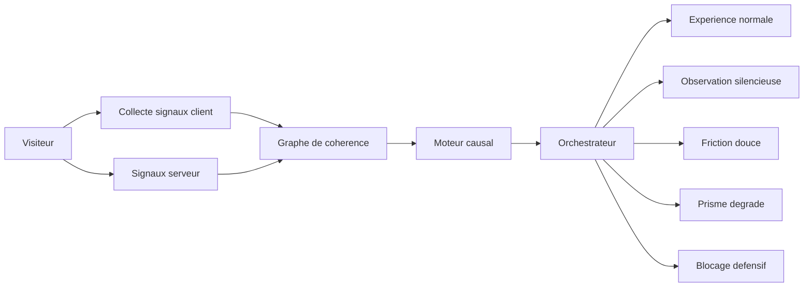
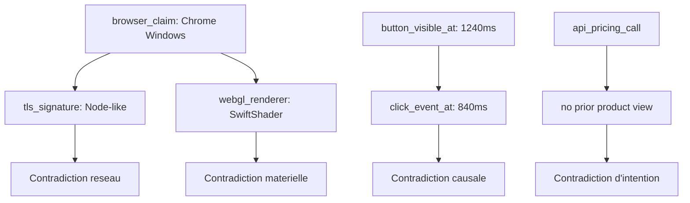
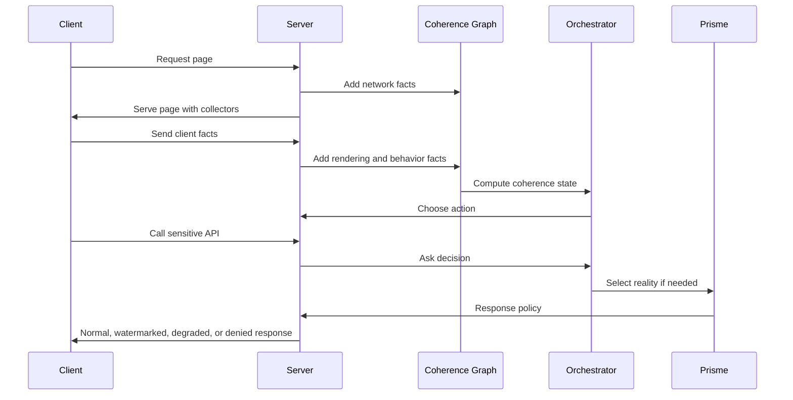

# NexAPI Antibot

## Architecture Prisme Causal

Ce document decrit une evolution complete de NexAPI Antibot vers une architecture plus avancee que le modele classique "score / seuil / blocage".

L'objectif n'est plus de juger brutalement un visiteur avec des points, mais de verifier si sa session produit une realite coherente.

Un humain peut etre lent, rapide, maladroit, fatigue, sur VPN, sur vieux telephone, ou dans un navigateur atypique. Il ne doit pas etre puni pour une seule anomalie.

Un bot sophistique peut imiter 99 % d'un comportement humain. Mais il finit souvent par trahir une contradiction entre ce qu'il pretend etre, ce qu'il voit, ce qu'il fait, ce qu'il demande au serveur, et la facon dont tout cela evolue dans le temps.

NexAPI Antibot ne cherche donc pas seulement a repondre a la question :

> Est-ce un humain ou un bot ?

Il cherche a repondre a une question plus forte :

> Cette session est-elle causalement coherente ?

---

## 1. Vision

### 1.1 Le probleme des antibots classiques

Les antibots traditionnels fonctionnent souvent avec une logique simple :

- un signal suspect est detecte ;
- un score baisse ;
- un seuil est franchi ;
- l'utilisateur est bloque, challenge, ou banni.

Cette approche fonctionne contre les bots simples, mais elle a trois faiblesses majeures :

- elle produit des faux positifs contre de vrais utilisateurs ;
- elle donne trop vite un retour clair a l'attaquant ;
- elle peut etre contournee par des bots qui imitent les signaux attendus.

Un bot moderne peut utiliser un vrai navigateur, simuler une souris humaine, modifier son fingerprint, ralentir ses actions, utiliser des proxies residentiels, et injecter des evenements plausibles.

Le probleme n'est donc plus seulement de detecter une anomalie.

Le vrai probleme est de detecter une contradiction.

### 1.2 La nouvelle doctrine

NexAPI Antibot adopte une doctrine en trois principes :

1. Ne jamais condamner sur un seul signal.
2. Ne jamais donner a l'attaquant une reponse trop informative.
3. Ne pas mesurer seulement le comportement, mais la coherence entre les causes et les actions.

Un humain n'est pas parfait, mais il est coherent.

Un bot peut etre propre sur chaque dimension isolee, mais incoherent quand on relie les dimensions entre elles.

---

## 2. Concepts Fondamentaux

### 2.1 Session

Une session est une unite temporaire d'observation. Elle regroupe :

- les caracteristiques reseau ;
- le navigateur declare ;
- l'environnement materiel ;
- les evenements client ;
- les interactions avec l'interface ;
- les appels API ;
- les decisions de securite ;
- les changements dans le temps.

La session n'est pas une identite personnelle. Elle ne doit pas servir a identifier durablement une personne.

### 2.2 Cohérence

La coherence est la capacite d'une session a raconter une histoire plausible.

Exemples :

- un navigateur declare Chrome sur Windows doit avoir des caracteristiques compatibles avec Chrome sur Windows ;
- un clic sur un bouton doit arriver apres que le bouton soit devenu visible et perceptible ;
- un appel API sensible doit suivre une navigation qui rend cet appel logique ;
- une lecture de contenu doit prendre un temps proportionnel a la densite de l'information ;
- un mouvement de souris doit correspondre a la cible visible, pas seulement a une coordonnee DOM.

### 2.3 Causalite

La causalite mesure le lien entre :

- ce qui est affiche ;
- ce que l'utilisateur peut percevoir ;
- ce qu'il fait ensuite ;
- ce que le serveur recoit.

Un humain agit parce qu'il voit, comprend, hesite, corrige, clique, revient, scrolle, compare.

Un bot agit souvent parce qu'un script a lu le DOM, trouve un selecteur, ou appele un endpoint.

### 2.4 Contradiction

Une contradiction est plus importante qu'une anomalie.

Une anomalie seule peut etre legitime :

- VPN ;
- ancien appareil ;
- navigateur rare ;
- lenteur reseau ;
- absence de souris sur mobile ;
- accessibilite ;
- entreprise avec proxy.

Une contradiction est plus forte :

- le navigateur pretend etre humain, mais les timings ressemblent a une execution automatisee ;
- l'utilisateur clique sur un element avant qu'il soit perceptible ;
- les appels API arrivent avant le parcours visuel attendu ;
- le rendu WebGL ne correspond pas a l'environnement declare ;
- les mouvements sont humains en surface, mais ne reagissent pas aux changements visuels reels.

---

## 3. Architecture Generale

NexAPI Antibot est compose de cinq grands blocs :

1. Collecte defensive des signaux.
2. Graphe de coherence de session.
3. Moteur causal.
4. Orchestrateur de decision adaptative.
5. Architecture Prisme.

### 3.1 Vue d'ensemble



---

## 4. Abandon du Modele a Points

### 4.1 Pourquoi abandonner les points

Un score du type "100 points au depart, puis -15 pour VPN, -40 pour absence de souris" est facile a comprendre, mais il est trop lineaire.

Le reel ne fonctionne pas comme cela.

Un humain peut cumuler plusieurs signaux atypiques sans etre un bot.

Un bot sophistique peut eviter chaque penalite connue.

Le score est utile pour afficher un niveau de risque, mais il ne doit pas etre le coeur de la decision.

### 4.2 Nouveau modele : matrice de coherence

Au lieu de retirer des points, le systeme construit une matrice de coherence :

| Domaine | Question posee | Exemple de coherence |
|---|---|---|
| Reseau | La connexion correspond-elle au navigateur declare ? | TLS, HTTP, IP, ASN et headers racontent une histoire compatible |
| Navigateur | L'environnement est-il plausible ? | APIs, fonts, WebGL, Audio, locale et timezone sont alignes |
| Rendu | Ce qui est vu correspond-il a ce qui est clique ? | L'action suit l'affichage reel |
| Temps | Les delais sont-ils causalement plausibles ? | Lecture, hesitation, scroll et clic ont une temporalite humaine |
| Intention | Le parcours a-t-il un sens ? | Les appels sensibles suivent une exploration logique |
| Memoire | La session evolue-t-elle naturellement ? | Les actions tiennent compte des etats precedents |
| Repetition | Le comportement se repete-t-il entre sessions ? | Meme structure d'extraction, memes timings, memes endpoints |

La decision vient de la coherence globale, pas d'un score brut.

---

## 5. Le Graphe de Coherence

### 5.1 Principe

Chaque session est representee comme un graphe.

Les noeuds representent des faits observes.

Les liens representent des relations de coherence ou de contradiction.

Exemples de noeuds :

- `network_profile`
- `tls_signature`
- `http_header_order`
- `browser_claim`
- `webgl_renderer`
- `viewport_state`
- `dom_visible_state`
- `pointer_path`
- `click_target`
- `api_sequence`
- `reading_delay`
- `focus_state`
- `session_seed`

Exemples de liens :

- `compatible_with`
- `contradicts`
- `caused_by`
- `too_early_for`
- `visually_consistent_with`
- `repeated_across_sessions`
- `requires_prior_state`

### 5.2 Exemple de contradiction forte



Cette session peut avoir une souris simulee parfaitement, mais elle reste incoherente.

---

## 6. Les 7 Couches Revisitees

Les 7 couches restent utiles, mais elles ne sont plus des juges independants qui retirent des points.

Elles deviennent des producteurs de faits pour le graphe de coherence.

### 6.1 L1 - Reseau et Protocole

Objectif :

Verifier si l'enveloppe reseau correspond a l'identite declaree du client.

Signaux :

- empreinte TLS ;
- ordre des headers HTTP ;
- coherence HTTP/2 ou HTTP/3 ;
- User-Agent ;
- accept-language ;
- accept-encoding ;
- coherence entre protocole, navigateur et plateforme ;
- presence de patterns connus de scripts.

Decision moderne :

L1 ne dit pas "bot".

L1 dit :

> Cette connexion ressemble-t-elle vraiment a ce que le navigateur pretend etre ?

### 6.2 L2 - Acces et Reputation

Objectif :

Comprendre la provenance et la dynamique d'acces.

Signaux :

- ASN ;
- type de reseau ;
- datacenter ;
- proxy ;
- VPN ;
- reputation IP ;
- velocite par IP ;
- velocite par fingerprint ;
- recurrence entre sessions ;
- dispersion geographique anormale.

Decision moderne :

Un datacenter n'est pas une preuve. Une entreprise legitime peut sortir par un proxy.

L2 devient fort quand il contredit d'autres couches :

- datacenter + automation ;
- proxy + extraction API ;
- rotation IP + meme fingerprint ;
- IP residentielle + comportement industriel.

### 6.3 L3 - Preuve de Cout Adaptative

Objectif :

Rendre les attaques de masse couteuses sans punir les humains.

La preuve de cout ne doit pas etre appliquee pareil pour tout le monde.

Modes possibles :

- aucun challenge pour les sessions propres ;
- challenge leger pour les sessions inconnues ;
- challenge progressif pour les sessions incoherentes ;
- challenge plus couteux uniquement pour les comportements de volume.

Important :

Le Proof of Work doit etre adaptatif selon :

- appareil mobile ;
- batterie ;
- performance CPU ;
- accessibilite ;
- historique de session ;
- criticite de l'action.

Le but n'est pas de fatiguer l'utilisateur. Le but est de rendre l'automatisation massive moins rentable.

### 6.4 L4 - Integrite de l'Environnement

Objectif :

Verifier que l'environnement client est plausible.

Signaux :

- WebGL ;
- Canvas ;
- AudioContext ;
- fonts ;
- timezone ;
- locale ;
- taille ecran ;
- device memory ;
- hardware concurrency ;
- coherence mobile/desktop ;
- coherence tactile/souris ;
- comportement du rendu graphique.

Decision moderne :

Le systeme ne doit pas chercher une empreinte unique persistante.

Il cherche une coherence temporaire :

> Est-ce que cet environnement ressemble a un appareil reel capable de produire les actions observees ?

### 6.5 L5 - Automatisation

Objectif :

Detecter les traces de pilotage automatique.

Signaux :

- `navigator.webdriver` ;
- traces connues de drivers ;
- anomalies de permissions ;
- incoherences dans les APIs natives ;
- comportement de `requestAnimationFrame` ;
- absence de bruit naturel d'execution ;
- interaction trop propre avec le DOM ;
- sequence d'evenements synthetiques.

Decision moderne :

La detection d'automatisation ne doit pas etre basee sur une seule signature.

Un bot peut masquer `navigator.webdriver`.

Ce qui compte est la coherence :

> Les evenements semblent-ils produits par une perception humaine ou par une lecture programmatique du DOM ?

### 6.6 L6 - Analyse Comportementale Non Identifiante

Objectif :

Analyser la coherence du mouvement et de l'attention sans identifier personnellement l'utilisateur.

Signaux :

- delai avant premiere action ;
- hesitation ;
- trajectoire ;
- micro-corrections ;
- accelerations ;
- pauses ;
- scroll ;
- retour en arriere ;
- focus et blur ;
- correlation entre densite visuelle et temps passe.

Regle importante :

Ne pas appeler cela "biometrie" dans le produit public si le systeme ne cherche pas a identifier une personne.

Le bon terme est :

> Analyse comportementale non identifiante de session.

### 6.7 L7 - Session et Cryptographie

Objectif :

Maintenir l'etat de securite sans exposer les informations sensibles a l'attaquant.

Recommandation :

Ne pas stocker directement dans un JWT lisible :

- niveau de suspicion ;
- raisons de detection ;
- seed interne ;
- etat Prisme ;
- decisions de securite.

Preferer :

- token opaque cote client ;
- etat complet cote serveur ;
- ou JWE chiffre si un token autoporteur est indispensable.

Le token client doit etre inutile a analyser pour l'attaquant.

---

## 7. Preuves de Perception

### 7.1 Principe

Un humain agit a partir de ce qu'il voit.

Un bot agit souvent a partir de ce qu'il lit.

Les preuves de perception verifient que les actions sont compatibles avec le rendu reel, pas seulement avec le DOM.

### 7.2 Exemples defensifs

Exemples de signaux possibles :

- legeres variations de layout par session ;
- ordre visuel different de l'ordre DOM ;
- elements presents dans le DOM mais invisibles a l'ecran ;
- zones cliquables calculees selon le rendu reel ;
- micro-delais avant activation d'une action ;
- etats visuels intermediaires ;
- verification que le clic vise la position rendue, pas seulement le selecteur.

### 7.3 Regle de securite

Ces preuves ne doivent pas degrader l'accessibilite.

Le systeme doit rester compatible avec :

- navigation clavier ;
- lecteurs d'ecran ;
- zoom ;
- preferences de reduction de mouvement ;
- appareils tactiles ;
- vieux navigateurs raisonnables.

---

## 8. Moteur d'Intention

### 8.1 Pourquoi l'intention compte

Un bot sophistique peut imiter une souris.

Il imite plus difficilement une intention humaine complete.

Un humain explore, compare, hesite, revient, lit, ajuste.

Un bot extrait, repete, optimise, contourne, appelle directement.

### 8.2 Types de trajectoires

Le systeme peut classer les trajectoires sans identifier personnellement l'utilisateur :

| Trajectoire | Description | Reponse |
|---|---|---|
| Exploration naturelle | Navigation variee, delais plausibles | Acces normal |
| Achat naturel | Consultation, choix, hesitation, action | Acces normal |
| Utilisateur presse | Peu d'actions mais sequence logique | Observation legere |
| Session inconnue | Donnees insuffisantes | Friction douce si action sensible |
| Extraction systematique | Parcours repetitif, endpoints sensibles | Prisme |
| API-first | Appels directs sans perception precedente | Prisme ou blocage |
| Abus actif | Volume, rotation, contradiction forte | Blocage defensif |

### 8.3 La logique du "minimum de friction"

Le systeme ne doit pas chercher a prouver qu'un humain est humain.

Il doit seulement appliquer la friction minimale necessaire selon le risque de l'action.

Lire une page publique ne demande pas le meme niveau de confiance qu'acheter, se connecter, extraire des prix, ou appeler une API sensible.

---

## 9. Architecture Prisme

### 9.1 Definition

Prisme est la couche de reponse adaptative.

Elle ne bloque pas systematiquement une session suspecte.

Elle adapte la realite servie a la coherence de la session.

### 9.2 Les realites Prisme

| Realite | Condition | Experience |
|---|---|---|
| Normale | Session coherente | Donnees completes, navigation fluide |
| Observee | Quelques inconnues, pas de contradiction forte | Experience normale, journalisation accrue |
| Ralentie | Risque moyen ou volume inhabituel | Delais, quotas, pagination limitee |
| Filigranee | Extraction possible mais pas certaine | Donnees exactes marquees par session |
| Degradee | Contradictions fortes mais pas abus direct | Donnees partielles, moins exploitables |
| Leurre | Bot avere sur endpoint non contractuel | Donnees pieges, non critiques, tracables |
| Bloquee | Abus actif ou risque eleve corrobore | Refus sobre, challenge ou ban temporaire |

### 9.3 Regle essentielle

Prisme ne doit jamais nuire a un vrai utilisateur sur une action contractuelle.

Par exemple :

- ne pas afficher un faux prix a un humain potentiel ;
- ne pas falsifier une commande ;
- ne pas modifier une facture ;
- ne pas tromper un client legitime.

Les donnees leurres doivent etre reservees :

- aux endpoints non contractuels ;
- aux honeypots ;
- aux ressources destinees aux scrapers averes ;
- aux environnements ou le risque juridique est maitrise.

### 9.4 Filigrane de session

Chaque reponse sensible peut porter un filigrane invisible.

Exemples :

- variation deterministe de l'ordre de certains elements ;
- identifiant non visible dans des metadonnees ;
- ordre de champs stable par session ;
- valeurs non critiques legerement personnalisees ;
- marque serveur associee a la session.

Objectif :

Si une base scrapee apparait ailleurs, on peut rattacher la fuite a une session ou a une famille de sessions.

---

## 10. Orchestrateur de Decision

### 10.1 Entrees

L'orchestrateur recoit :

- graphe de coherence ;
- contradictions detectees ;
- niveau de certitude ;
- criticite de l'action ;
- historique court de session ;
- contexte reseau ;
- signaux d'abus ;
- politique produit.

### 10.2 Sorties

Il ne sort pas seulement "allow" ou "deny".

Il peut sortir :

- `allow_normal`
- `allow_observed`
- `allow_rate_limited`
- `challenge_light`
- `challenge_cost`
- `prisme_watermarked`
- `prisme_degraded`
- `prisme_decoy`
- `deny_soft`
- `deny_hard`
- `temporary_ban`

### 10.3 Exemple de logique

```js
function decideSessionAction(context) {
  const contradictions = context.coherenceGraph.contradictions;
  const actionRisk = context.request.actionRisk;
  const abuse = context.abuseSignals;

  if (abuse.activeAttack && contradictions.hasIndependentProofs(2)) {
    return "temporary_ban";
  }

  if (context.request.isContractualAction) {
    if (contradictions.isHigh()) {
      return "challenge_light";
    }

    return "allow_normal";
  }

  if (context.request.isSensitiveDataEndpoint) {
    if (contradictions.isVeryHigh()) {
      return "prisme_degraded";
    }

    if (contradictions.isMedium()) {
      return "prisme_watermarked";
    }
  }

  if (contradictions.isLow()) {
    return "allow_observed";
  }

  return "allow_normal";
}
```

Ce code est volontairement conceptuel. Le coeur n'est pas une formule magique, mais une politique claire :

- proteger les humains ;
- augmenter le cout des bots ;
- reduire le feedback donne aux attaquants ;
- ne pas prendre de decision dure sans corroboration.

---

## 11. Gestion des Faux Positifs

### 11.1 Principe

Un faux positif est plus grave qu'un bot laisse passer sur une page peu critique.

Le systeme doit donc etre conservateur sur les blocages.

### 11.2 Actions autorisees pour une session incertaine

Pour une session etrange mais pas dangereuse :

- observer ;
- ralentir legerement ;
- limiter le volume ;
- demander une confirmation douce ;
- filigraner les reponses ;
- reduire les endpoints sensibles ;
- proposer une voie de recuperation.

### 11.3 Actions a eviter

Eviter :

- ban definitif sur un seul signal ;
- faux prix sur parcours client legitime ;
- challenge lourd des la premiere page ;
- message accusatoire ;
- redirection visible vers un site tiers ;
- conservation excessive des donnees comportementales.

---

## 12. Protection des APIs

### 12.1 Doctrine API

Les APIs ne doivent pas etre protegees uniquement par le fait qu'un utilisateur a charge une page.

Chaque appel sensible doit etre relie a une histoire plausible.

Question cle :

> L'appel API est-il la consequence logique d'une action visible precedente ?

### 12.2 Exemple de coherence API

Pour `/api/pricing` :

La session devrait avoir :

- visite d'une page produit ;
- rendu du bloc prix ;
- delai plausible de lecture ;
- interaction ou scroll compatible ;
- appel API dans une fenetre temporelle logique.

Si `/api/pricing` est appele directement, massivement, ou sans perception precedente, Prisme peut s'activer.

### 12.3 Reponses possibles

| Etat | Reponse |
|---|---|
| Session coherente | Prix normal |
| Session inconnue | Prix normal mais quota limite |
| Session suspecte | Prix normal filigrane ou cache partiel |
| Extraction probable | Donnees degradees ou retardees |
| Bot avere | Endpoint leurre ou blocage sobre |

---

## 13. Donnees et Stockage

### 13.1 Donnees de session recommandees

```js
{
  sessionId: "opaque_public_id",
  internalSeed: "server_only_secret",
  createdAt: "date",
  lastSeenAt: "date",
  coherenceState: {
    contradictions: [],
    confirmations: [],
    uncertainty: "low | medium | high"
  },
  prismeState: {
    reality: "normal | observed | slowed | watermarked | degraded | decoy | blocked",
    reasonCodes: []
  },
  requestHistory: [],
  abuseHistory: []
}
```

### 13.2 Donnees a eviter cote client

Ne pas exposer :

- `suspicion = 1.0` ;
- raisons exactes de detection ;
- seed interne ;
- etat Prisme ;
- seuils ;
- politique de decision.

Le client ne doit recevoir qu'un jeton opaque ou chiffre.

### 13.3 Retention

Les donnees doivent etre conservees le moins longtemps possible.

Recommandation :

- session courte : quelques heures ;
- signaux agreges : quelques jours ;
- abus confirme : duree limitee et justifiee ;
- donnees comportementales brutes : retention minimale ou transformation immediate en indicateurs non identifiants.

---

## 14. Confidentialite et Cadre Legal

### 14.1 Minimisation

Collecter seulement les signaux necessaires a la securite.

Ne pas transformer l'antibot en outil de surveillance marketing.

### 14.2 Transparence raisonnable

Il n'est pas necessaire de reveler les mecanismes exacts, mais la politique de confidentialite doit indiquer que le site utilise des mesures de securite pour :

- prevenir la fraude ;
- limiter l'abus ;
- proteger les services ;
- detecter l'automatisation ;
- assurer l'integrite des APIs.

### 14.3 Donnees comportementales

Si le systeme analyse souris, clavier, scroll ou timing, il faut eviter toute promesse excessive.

Formulation recommandee :

> Nous pouvons analyser des signaux techniques et comportementaux de session afin de proteger le service contre l'automatisation abusive, sans chercher a identifier personnellement l'utilisateur par biometrie.

---

## 15. Architecture Technique Proposee

### 15.1 Modules

```txt
src/
  antibot/
    collectors/
      networkCollector.js
      browserCollector.js
      renderingCollector.js
      behaviorCollector.js
      apiIntentCollector.js
    coherence/
      coherenceGraph.js
      contradictionRules.js
      causalEngine.js
    prisme/
      prismePolicy.js
      watermark.js
      degradedResponses.js
      decoyResponses.js
    session/
      sessionStore.js
      tokenService.js
      visitorTracker.js
    orchestrator/
      decisionEngine.js
      actionPolicy.js
    observability/
      securityEvents.js
      metrics.js
      auditLog.js
```

### 15.2 Flux serveur



---

## 16. Strategie de Reponse

### 16.1 Ne pas etre previsible

Le systeme ne doit pas appliquer exactement la meme reponse a chaque bot.

Il peut varier :

- delai ;
- quota ;
- niveau de detail ;
- ordre de reponse ;
- activation de filigrane ;
- challenge ;
- limitation d'endpoint.

Attention :

La variation doit rester compatible avec l'experience humaine et les obligations produit.

### 16.2 Ne pas donner de message trop precis

Mauvais message :

> Votre WebGL SwiftShader indique un navigateur headless.

Bon message :

> Nous n'avons pas pu verifier cette session. Veuillez reessayer.

### 16.3 Bloquer seulement quand c'est utile

Le blocage doit etre reserve aux cas ou :

- l'abus est actif ;
- le volume est dangereux ;
- plusieurs contradictions independantes existent ;
- une action critique est visee ;
- la voie Prisme ne suffit plus.

---

## 17. Mesures de Succes

### 17.1 Metriques defensives

Mesurer :

- taux de faux positifs ;
- taux de challenge reussi ;
- taux de conversion humain ;
- volume API suspect ;
- cout impose aux attaques ;
- temps moyen avant detection ;
- quantite de donnees scrapees filigranees ;
- reutilisation externe de donnees filigranees.

### 17.2 Metriques a ne pas optimiser aveuglement

Ne pas optimiser uniquement :

- nombre de bots bloques ;
- score moyen de suspicion ;
- nombre de bans ;
- durete des challenges.

Un bon antibot peut bloquer moins visiblement, mais neutraliser mieux.

---

## 18. Roadmap

### Phase 1 - Base solide

- Mettre en place le token opaque.
- Centraliser l'etat de session cote serveur.
- Brancher `visitorTracker`.
- Journaliser les signaux serveur.
- Ajouter les premieres regles de contradiction.

### Phase 2 - Coherence client

- Collecter les signaux de rendu.
- Ajouter les evenements comportementaux non identifiants.
- Verifier la coherence perception/action.
- Ajouter les premieres preuves de perception.

### Phase 3 - Prisme defensif

- Ajouter les realites `observed`, `slowed`, `watermarked`.
- Filigraner les endpoints sensibles.
- Ajouter les quotas adaptatifs.
- Eviter les donnees fausses sur les parcours contractuels.

### Phase 4 - Prisme avance

- Ajouter les reponses degradees.
- Ajouter les honeypots API.
- Creer des endpoints leurres pour scrapers averes.
- Associer les fuites externes aux filigranes.

### Phase 5 - Intelligence de trajectoire

- Construire le moteur d'intention.
- Comparer les sessions par familles de comportements.
- Detecter l'extraction multi-IP.
- Ajouter des politiques par type d'action.

---

## 19. Exemple de Politique Complete

### 19.1 Page publique

Politique :

- laisser passer largement ;
- collecter peu ;
- observer les inconnus ;
- ne challenger que les volumes abusifs.

### 19.2 Page produit

Politique :

- verifier coherence de navigation ;
- filigraner certaines donnees non visibles ;
- limiter les appels repetes ;
- observer les contradictions.

### 19.3 API prix

Politique :

- exiger une histoire plausible avant l'appel ;
- appliquer quota par session et par famille ;
- filigraner les reponses suspectes ;
- degrader les reponses des extracteurs probables ;
- ne jamais afficher de faux prix contractuel a un humain potentiel.

### 19.4 Connexion et paiement

Politique :

- ne pas utiliser de donnees leurres ;
- challenge doux si doute ;
- blocage seulement sur abus corrobore ;
- journalisation forte ;
- voie de recuperation claire.

---

## 20. Glossaire

### Coherence

Compatibilite globale entre les signaux d'une session.

### Contradiction

Conflit fort entre deux ou plusieurs faits observes.

### Causalite

Lien logique entre ce qui est visible, ce qui est percu, et ce qui est fait.

### Prisme

Architecture qui adapte la realite servie a une session selon son niveau de coherence et le risque de l'action.

### Filigrane

Marque invisible ou non critique permettant de reconnaitre une fuite ou une extraction.

### Realite degradee

Experience volontairement limitee ou moins exploitable, sans nuire aux actions legitimes.

### Leurre

Reponse piege reservee aux bots averes, sur des endpoints non contractuels ou controles.

---

## 21. Resume Executif

NexAPI Antibot Prisme Causal repose sur une idee centrale :

> Le futur de l'antibot n'est pas de compter des points. Le futur est de verifier la coherence causale d'une session.

Un humain n'est pas toujours propre techniquement, mais ses actions ont une logique perceptive.

Un bot sophistique peut imiter des signaux humains, mais il doit maintenir une coherence parfaite entre reseau, navigateur, rendu, timing, intention et APIs. Plus il essaie d'imiter, plus il augmente sa complexite et son cout.

Prisme transforme cette detection en avantage strategique :

- les humains restent fluides ;
- les sessions incertaines sont observees ou legerement ralenties ;
- les scrapers sont filigranes ;
- les bots averes sont degrades, trompes sur des ressources controlees, ou bloques ;
- l'attaquant recoit le moins de feedback possible.

La force du systeme n'est pas d'etre brutal.

Sa force est d'etre silencieux, coherent, adaptatif, et difficile a comprendre depuis l'exterieur.
