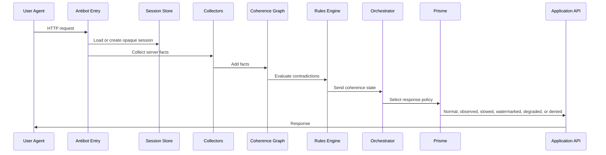

# NexAPI Antibot

## Plan d'Implementation - Prisme Causal

Ce document transforme l'architecture "Prisme Causal" en plan d'implementation concret.

L'objectif est de construire un antibot avance, discret, progressif et robuste contre les bots sophistiques, sans bloquer brutalement les humains legitimes.

La logique centrale n'est pas :

> Donner des points, puis bloquer sous un seuil.

La logique centrale est :

> Collecter des faits, detecter des contradictions, mesurer la coherence causale, puis choisir la reponse minimale adaptee au risque.

---

## 1. Objectifs

### 1.1 Objectif principal

Construire un systeme capable de :

- reconnaitre les sessions humaines plausibles ;
- detecter les contradictions des bots sophistiques ;
- proteger les APIs sensibles ;
- reduire les faux positifs ;
- eviter de donner un signal clair aux attaquants ;
- appliquer Prisme uniquement quand cela est utile et defensable.

### 1.2 Objectifs techniques

Le systeme doit fournir :

- une session opaque cote client ;
- un etat de session cote serveur ;
- une collecte de faits serveur et client ;
- un graphe de coherence ;
- un moteur de contradictions ;
- un orchestrateur de decision ;
- des reponses Prisme adaptatives ;
- une journalisation exploitable ;
- des tests de non-regression ;
- des garde-fous pour la confidentialite.

### 1.3 Non-objectifs

Le systeme ne doit pas :

- identifier personnellement les utilisateurs ;
- conserver des donnees comportementales brutes longtemps ;
- bloquer definitivement sur un seul signal ;
- exposer les raisons de detection au client ;
- afficher de faux prix dans un parcours contractuel ;
- transformer l'antibot en outil marketing.

---

## 2. Principe d'Implementation

NexAPI Antibot doit etre implemente en couches.

Il ne faut pas commencer par le moteur le plus complexe.

Le MVP solide est :

1. Token opaque.
2. Session serveur.
3. Collecte de faits.
4. Regles de contradiction.
5. Orchestrateur.
6. Prisme observe / ralenti / filigrane.

Les modules avances comme les preuves de perception, l'analyse comportementale et les leurres doivent arriver plus tard, quand le socle est stable.

---

## 3. Architecture Cible

### 3.1 Arborescence proposee

```txt
src/
  antibot/
    config/
      antibotConfig.js
      actionRisk.js

    session/
      tokenService.js
      sessionStore.js
      sessionModel.js
      visitorTracker.js

    collectors/
      networkCollector.js
      requestCollector.js
      clientCollector.js
      behaviorCollector.js
      renderingCollector.js
      apiIntentCollector.js

    coherence/
      coherenceGraph.js
      factModel.js
      contradictionModel.js
      contradictionRules.js
      contradictionEngine.js
      independence.js

    causal/
      causalEngine.js
      perceptionEngine.js
      intentionEngine.js

    orchestrator/
      decisionEngine.js
      actionPolicy.js
      responsePolicy.js

    prisme/
      prismePolicy.js
      watermark.js
      rateLimiter.js
      degradedResponses.js
      decoyResponses.js

    middleware/
      antibotEntry.js
      collectRequestFacts.js
      attachDecision.js
      enforceDecision.js

    observability/
      securityEvents.js
      metrics.js
      auditLog.js

    client/
      antibotClient.js
      collectRendering.js
      collectBehavior.js
      collectPerception.js

    tests/
      fixtures/
      unit/
      integration/
      e2e/
```

### 3.2 Flux global



---

## 4. Phases d'Implementation

## Phase 1 - Socle Session Opaque

### Objectif

Chaque requete doit etre reliee a une session serveur sans exposer l'etat de securite au client.

### Modules a creer

- `session/tokenService.js`
- `session/sessionStore.js`
- `session/sessionModel.js`
- `session/visitorTracker.js`
- `observability/securityEvents.js`

### Regles

- Le client recoit uniquement un identifiant opaque.
- Les donnees sensibles restent cote serveur.
- Le token ne contient pas `suspicion`, `score`, `seed`, `reasonCodes`, ou `prismeState`.
- Le token doit etre signe ou aleatoire fort.
- La session doit expirer automatiquement.

### Exemple de session serveur

```js
{
  id: "sess_opaque_public_id",
  internalSeed: "server_only_secret",
  createdAt: 1710000000000,
  lastSeenAt: 1710000000000,
  ipHistory: [],
  userAgentHistory: [],
  facts: [],
  contradictions: [],
  decisions: [],
  prisme: {
    reality: "normal",
    updatedAt: 1710000000000
  },
  counters: {
    requests: 0,
    sensitiveApiCalls: 0,
    challenges: 0
  }
}
```

### Criteres de fin

- Une session est creee si absente.
- Une session est retrouvee si le token est present.
- Le token client ne revele aucune information sensible.
- Les sessions expirent correctement.
- Chaque requete contient `req.visitor`.

---

## Phase 2 - Collecte de Faits Serveur

### Objectif

Collecter des faits simples, fiables et peu intrusifs avant toute logique avancee.

### Modules a creer

- `collectors/networkCollector.js`
- `collectors/requestCollector.js`
- `collectors/apiIntentCollector.js`
- `coherence/factModel.js`

### Types de faits initiaux

```js
{
  id: "fact_unique_id",
  sessionId: "sess_id",
  type: "network | request | api | navigation | environment | behavior",
  name: "api_call",
  value: {
    path: "/api/pricing",
    method: "GET"
  },
  confidence: "low | medium | high",
  source: "server | client",
  createdAt: 1710000000000
}
```

### Faits prioritaires

- IP courante.
- User-Agent.
- Accept-Language.
- Accept-Encoding.
- Ordre approximatif des headers si disponible.
- Route demandee.
- Methode HTTP.
- Referrer.
- Frequence de requetes.
- Appels API sensibles.
- Page precedente connue.
- Presence ou absence de session.

### Criteres de fin

- Les faits serveur sont attaches a la session.
- Les appels API sensibles sont identifies.
- Les faits peuvent etre rejoues en test.
- La collecte ne bloque aucun utilisateur.

---

## Phase 3 - Graphe de Coherence Minimal

### Objectif

Transformer les faits en relations exploitables.

### Modules a creer

- `coherence/coherenceGraph.js`
- `coherence/contradictionModel.js`
- `coherence/contradictionRules.js`
- `coherence/contradictionEngine.js`
- `coherence/independence.js`

### Modele de contradiction

```js
{
  id: "api_before_visual_context",
  title: "Sensitive API called before page context",
  severity: "low | medium | high | critical",
  domains: ["api", "intent"],
  independentGroup: "api_intent",
  facts: ["fact_1", "fact_2"],
  confidence: "low | medium | high",
  createdAt: 1710000000000
}
```

### Regles MVP

#### `api_before_visual_context`

Declenchement :

- appel a une API sensible ;
- aucune page compatible visitee avant l'appel ;
- aucun contexte visuel connu.

Severite :

- `medium` si une seule fois ;
- `high` si repete ;
- `critical` si combine avec volume ou rotation.

#### `request_velocity_spike`

Declenchement :

- trop de requetes dans une fenetre courte ;
- repetition sur endpoints sensibles.

Severite :

- `medium` par defaut ;
- `high` si endpoints sensibles.

#### `session_identity_drift`

Declenchement :

- meme session avec changements incoherents de User-Agent ;
- changement rapide de pays ou ASN ;
- incoherence forte entre IP et empreinte.

Severite :

- `medium` ou `high` selon amplitude.

#### `api_first_session`

Declenchement :

- premiere action connue = appel API sensible ;
- aucun chargement de page publique avant.

Severite :

- `high`.

### Criteres de fin

- Les contradictions sont detectees sans score numerique.
- Chaque contradiction cite les faits sources.
- Les contradictions sont groupees par domaines independants.
- Les tests couvrent au moins 10 scenarios.

---

## Phase 4 - Orchestrateur de Decision

### Objectif

Choisir une action adaptee au risque sans bloquer brutalement.

### Modules a creer

- `orchestrator/decisionEngine.js`
- `orchestrator/actionPolicy.js`
- `orchestrator/responsePolicy.js`

### Actions possibles

```txt
allow_normal
allow_observed
allow_rate_limited
challenge_light
challenge_cost
prisme_watermarked
prisme_degraded
prisme_decoy
deny_soft
deny_hard
temporary_ban
```

### Politique MVP

| Situation | Action |
|---|---|
| Pas de contradiction | `allow_normal` |
| Donnees insuffisantes | `allow_observed` |
| Contradiction faible | `allow_observed` |
| Contradiction moyenne sur API sensible | `prisme_watermarked` |
| Volume inhabituel | `allow_rate_limited` |
| Contradiction forte unique | `challenge_light` ou `prisme_watermarked` |
| Deux contradictions independantes | `prisme_degraded` |
| Abus actif + deux preuves independantes | `deny_soft` ou `temporary_ban` |
| Action contractuelle avec doute | `challenge_light`, jamais leurre |

### Exemple de decision engine

```js
function decideSessionAction(context) {
  const contradictions = context.contradictions;
  const request = context.request;
  const independentProofs = countIndependentProofs(contradictions);

  if (request.isContractualAction) {
    if (independentProofs >= 2) {
      return "challenge_light";
    }

    return "allow_normal";
  }

  if (context.abuse.active && independentProofs >= 2) {
    return "deny_soft";
  }

  if (request.isSensitiveApi && independentProofs >= 2) {
    return "prisme_degraded";
  }

  if (request.isSensitiveApi && contradictions.hasSeverity("medium")) {
    return "prisme_watermarked";
  }

  if (context.velocity.isHigh) {
    return "allow_rate_limited";
  }

  if (contradictions.any()) {
    return "allow_observed";
  }

  return "allow_normal";
}
```

### Criteres de fin

- Aucune decision dure n'est prise sur un seul signal.
- Les actions contractuelles ne recoivent jamais de donnees leurres.
- Les decisions sont journalisees.
- Les tests couvrent chaque action.

---

## Phase 5 - Prisme Defensif

### Objectif

Activer les realites Prisme les moins risquees.

### Modules a creer

- `prisme/prismePolicy.js`
- `prisme/watermark.js`
- `prisme/rateLimiter.js`

### Realites MVP

#### `normal`

Session coherente.

Reponse :

- aucune degradation ;
- experience normale.

#### `observed`

Session inconnue ou legerement etrange.

Reponse :

- experience normale ;
- journalisation accrue ;
- pas de friction visible.

#### `slowed`

Volume inhabituel ou risque moyen.

Reponse :

- quotas ;
- delais faibles ;
- pagination limitee ;
- cache plus agressif.

#### `watermarked`

Suspicion raisonnable sur extraction.

Reponse :

- donnees exactes ;
- marque invisible ;
- ordre stable par session ;
- metadata serveur non critique.

### Filigrane

Le filigrane doit etre :

- deterministe par session ;
- invisible pour l'utilisateur normal ;
- non contractuel ;
- stable assez longtemps pour l'attribution ;
- impossible a deviner sans le secret serveur.

### Exemple de watermark

```js
function watermarkList(items, sessionSeed) {
  const offset = stableModulo(sessionSeed, items.length);

  return rotate(items, offset).map((item, index) => ({
    ...item,
    _metaOrder: index
  }));
}
```

### Criteres de fin

- Les APIs sensibles peuvent recevoir une reponse filigranee.
- Les humains ne voient aucune difference nuisible.
- Les decisions Prisme sont tracees.
- Le filigrane est reproductible par session.

---

## Phase 6 - Collecteurs Client

### Objectif

Ajouter des signaux client sans surcharger l'utilisateur ni degrader l'accessibilite.

### Modules a creer

- `client/antibotClient.js`
- `client/collectRendering.js`
- `client/collectBehavior.js`
- `client/collectPerception.js`
- `collectors/clientCollector.js`
- `collectors/renderingCollector.js`
- `collectors/behaviorCollector.js`

### Signaux prioritaires

#### Rendu

- viewport ;
- device pixel ratio ;
- WebGL vendor et renderer ;
- support Canvas ;
- support AudioContext ;
- mode tactile ou souris ;
- coherence mobile/desktop.

#### Comportement non identifiant

- temps avant premiere interaction ;
- scroll ;
- focus et blur ;
- mouvement approximatif ;
- micro-corrections ;
- sequence d'evenements ;
- delai entre affichage et clic.

#### Perception

- element visible avant action ;
- action dans zone rendue ;
- ordre visuel compatible ;
- delai plausible apres apparition.

### Regle de confidentialite

Les donnees brutes doivent etre :

- reduites rapidement en indicateurs ;
- limitees a la session ;
- supprimees vite ;
- jamais vendues ou reutilisees pour du marketing.

### Criteres de fin

- Les signaux client arrivent au serveur.
- Une session sans JavaScript reste utilisable avec friction minimale.
- Les lecteurs d'ecran et la navigation clavier restent compatibles.
- Les signaux client enrichissent les contradictions, mais ne deviennent pas une preuve unique de ban.

---

## Phase 7 - Moteur Causal

### Objectif

Detecter si les actions ont une cause plausible.

### Modules a creer

- `causal/causalEngine.js`
- `causal/perceptionEngine.js`
- `causal/intentionEngine.js`

### Questions du moteur causal

- L'action est-elle arrivee apres l'affichage de la cible ?
- Le delai est-il plausible ?
- La cible etait-elle visible dans le viewport ?
- La session a-t-elle parcouru le contenu necessaire ?
- L'appel API est-il la suite logique d'une action visible ?
- La trajectoire globale ressemble-t-elle a une intention humaine ou a une extraction ?

### Contradictions causales

#### `click_before_visible`

Un clic arrive avant que l'element soit visible ou active.

#### `api_without_intent`

Un endpoint sensible est appele sans page ou action precedente compatible.

#### `dom_driven_action`

Les actions suivent une structure DOM invisible plutot qu'une structure visuelle.

#### `reading_time_impossible`

Une action complexe arrive sans delai minimal de perception.

### Criteres de fin

- Les contradictions causales sont distinguees des anomalies simples.
- Les faux positifs sont mesures.
- Les decisions restent prudentes.

---

## Phase 8 - Prisme Avance

### Objectif

Ajouter des realites plus offensives uniquement pour les bots averes.

### Realites avancees

#### `degraded`

Reponse :

- donnees partielles ;
- details reduits ;
- pagination fragmentee ;
- cache retardee ;
- champs non critiques absents.

#### `decoy`

Reponse :

- endpoint leurre ;
- donnees pieges ;
- ressources non contractuelles ;
- usage uniquement contre bots averes.

### Regles strictes

Ne jamais utiliser `decoy` pour :

- prix visibles par un client potentiel ;
- paiement ;
- commande ;
- facture ;
- authentification ;
- support ;
- information juridiquement engageante.

### Criteres de fin

- Les endpoints leurres sont separes des endpoints produit.
- Les donnees leurres ne peuvent pas toucher un humain legitime.
- Les decisions `decoy` exigent plusieurs preuves independantes.
- Les logs permettent d'analyser les extractions.

---

## 5. Middleware Express Propose

### 5.1 Ordre des middlewares

```txt
1. antibotEntry
2. visitorTracker
3. collectRequestFacts
4. contradictionEngine
5. attachDecision
6. routes application
7. enforceDecision ou prismeResponse
```

### 5.2 Exemple conceptuel

```js
app.use(antibotEntry);
app.use(visitorTracker);
app.use(collectRequestFacts);
app.use(attachDecision);

app.get("/api/pricing", pricingController);
```

Dans le controller :

```js
function pricingController(req, res) {
  if (req.antibot.action === "prisme_watermarked") {
    return res.json(watermarkPricing(realPricing(), req.visitor.internalSeed));
  }

  if (req.antibot.action === "prisme_degraded") {
    return res.json(degradedPricing());
  }

  if (req.antibot.action === "allow_rate_limited") {
    res.set("X-RateLimit-Policy", "adaptive");
  }

  return res.json(realPricing());
}
```

---

## 6. Modele de Donnees

### 6.1 Session

```js
{
  id: "sess_x",
  publicTokenHash: "hash",
  internalSeed: "secret",
  createdAt: 1710000000000,
  lastSeenAt: 1710000000000,
  expiresAt: 1710003600000,
  state: "active | expired | banned",
  prismeReality: "normal | observed | slowed | watermarked | degraded | decoy | blocked"
}
```

### 6.2 Fact

```js
{
  id: "fact_x",
  sessionId: "sess_x",
  type: "network",
  name: "user_agent_seen",
  value: {},
  source: "server",
  confidence: "high",
  createdAt: 1710000000000
}
```

### 6.3 Contradiction

```js
{
  id: "contradiction_x",
  sessionId: "sess_x",
  ruleId: "api_before_visual_context",
  severity: "high",
  domains: ["api", "intent"],
  independentGroup: "api_intent",
  factIds: ["fact_a", "fact_b"],
  confidence: "medium",
  createdAt: 1710000000000
}
```

### 6.4 Decision

```js
{
  id: "decision_x",
  sessionId: "sess_x",
  requestId: "req_x",
  action: "prisme_watermarked",
  reasonCodes: ["api_before_visual_context"],
  safeForContractualAction: true,
  createdAt: 1710000000000
}
```

---

## 7. Configuration

### 7.1 Variables d'environnement

```txt
ANTIBOT_ENABLED=true
ANTIBOT_MODE=observe
ANTIBOT_SESSION_TTL_MINUTES=240
ANTIBOT_TOKEN_COOKIE=nexapi_sid
ANTIBOT_COOKIE_SECURE=true
ANTIBOT_COOKIE_SAMESITE=Lax
ANTIBOT_WATERMARK_SECRET=change_me
ANTIBOT_PRISME_ENABLED=false
ANTIBOT_DECoy_ENABLED=false
ANTIBOT_LOG_LEVEL=info
```

### 7.2 Modes

| Mode | Description |
|---|---|
| `off` | Aucun traitement antibot |
| `observe` | Collecte + decisions loguees, pas d'effet utilisateur |
| `soft` | Rate limit + watermark |
| `prisme` | Realites Prisme actives |
| `strict` | Blocage possible sur abus corrobore |

Le deploiement doit commencer en `observe`.

---

## 8. Tests

### 8.1 Tests unitaires

Tester :

- creation de token opaque ;
- expiration session ;
- ajout de facts ;
- evaluation des regles ;
- independance des contradictions ;
- decisions orchestrateur ;
- watermark deterministe.

### 8.2 Tests d'integration

Scenarios :

- utilisateur normal page publique ;
- utilisateur normal API apres page produit ;
- appel API direct sans contexte ;
- volume eleve ;
- session avec changement d'identite ;
- action contractuelle suspecte ;
- endpoint sensible avec watermark.

### 8.3 Tests faux positifs

Cas obligatoires :

- VPN ;
- proxy entreprise ;
- mobile lent ;
- lecteur d'ecran ;
- navigation clavier ;
- vieux navigateur ;
- utilisateur tres rapide ;
- utilisateur qui ne bouge pas la souris ;
- onglet inactif puis retour ;
- refresh plusieurs fois.

### 8.4 Tests de securite

Verifier :

- le token ne contient aucune donnee sensible ;
- les reason codes ne sont pas envoyes au client ;
- les logs ne contiennent pas de secrets ;
- les endpoints leurres sont separes ;
- les actions contractuelles ne sont jamais degradees.

---

## 9. Observabilite

### 9.1 Evenements a journaliser

```txt
session.created
session.loaded
fact.recorded
contradiction.detected
decision.created
prisme.applied
rate_limit.applied
challenge.requested
deny.applied
session.expired
```

### 9.2 Metriques

Mesurer :

- sessions observees ;
- contradictions par domaine ;
- decisions par action ;
- taux de rate limit ;
- taux de challenge ;
- taux de reussite challenge ;
- impact conversion ;
- faux positifs signales ;
- volume API suspect ;
- reutilisation de filigranes.

### 9.3 Dashboard minimal

Le dashboard doit afficher :

- trafic total ;
- trafic sensible ;
- decisions antibot ;
- top rules declenchees ;
- sessions en Prisme ;
- taux d'erreur ;
- latence ajoutee ;
- faux positifs.

---

## 10. Rollout Production

### Etape 1 - Observe

Activer :

- sessions ;
- facts ;
- contradictions ;
- decisions loguees.

Ne pas appliquer :

- blocage ;
- degradation ;
- leurre.

Objectif :

Verifier la qualite des signaux.

### Etape 2 - Soft

Activer :

- quotas doux ;
- watermark ;
- observation accrue.

Objectif :

Proteger sans risque visible.

### Etape 3 - Prisme

Activer :

- ralentissement ;
- degradation non contractuelle ;
- endpoints sensibles proteges.

Objectif :

Neutraliser l'extraction.

### Etape 4 - Strict

Activer :

- deny soft ;
- ban temporaire ;
- decoy sur endpoints dedies.

Objectif :

Repondre aux abus confirmes.

---

## 11. Politique par Type de Route

### 11.1 Page publique

Action par defaut :

- `allow_normal`

Actions possibles :

- `allow_observed`
- `allow_rate_limited`

Actions interdites :

- `prisme_decoy`
- faux contenu critique

### 11.2 Page produit

Action par defaut :

- `allow_normal`

Actions possibles :

- `allow_observed`
- `prisme_watermarked`
- `allow_rate_limited`

### 11.3 API prix

Action par defaut :

- `allow_normal`

Actions possibles :

- `prisme_watermarked`
- `prisme_degraded`
- `allow_rate_limited`
- `challenge_light`

Regle :

Ne jamais afficher un faux prix contractuel a un humain potentiel.

### 11.4 Authentification

Action par defaut :

- `allow_normal`

Actions possibles :

- `challenge_light`
- `deny_soft` si attaque corroboree

Actions interdites :

- `prisme_decoy`
- reponse trompeuse

### 11.5 Paiement

Action par defaut :

- `allow_normal`

Actions possibles :

- `challenge_light`
- `deny_soft` si risque critique

Actions interdites :

- degradation de donnees ;
- leurre ;
- faux prix ;
- modification invisible.

---

## 12. Regles de Qualite

### 12.1 Regle anti faux positif

Aucune decision dure ne doit etre prise sans :

- au moins deux contradictions independantes ;
- ou un abus actif mesure ;
- ou une politique explicite sur une route critique.

### 12.2 Regle de discretion

Les reponses d'erreur doivent rester generiques.

Ne jamais reveler :

- la regle declenchee ;
- le niveau de risque ;
- le domaine de contradiction ;
- la realite Prisme active.

### 12.3 Regle de reversibilite

Toute action dure doit etre temporaire ou recuperable.

Exemples :

- ban 15 minutes ;
- challenge doux ;
- retry ;
- support ;
- expiration automatique.

---

## 13. Definition du MVP

Le MVP complet de NexAPI Antibot Prisme Causal contient :

- token opaque ;
- session store ;
- visitor tracker ;
- collecte serveur ;
- facts ;
- contradictions ;
- decision engine ;
- mode observe ;
- mode soft ;
- watermark ;
- rate limit ;
- logs ;
- tests unitaires ;
- tests faux positifs.

Le MVP ne contient pas encore :

- leurres ;
- faux contenus ;
- analyse comportementale avancee ;
- proof of work lourd ;
- ban automatique agressif.

---

## 14. Checklist de Livraison

### Socle

- [ ] Token opaque implemente.
- [ ] Session store implemente.
- [ ] Cookie securise configure.
- [ ] `req.visitor` disponible.
- [ ] Expiration session testee.

### Collecte

- [ ] Facts serveur collectes.
- [ ] Facts API collectes.
- [ ] Facts navigation collectes.
- [ ] Logs securite disponibles.

### Coherence

- [ ] Contradiction model implemente.
- [ ] Rules engine implemente.
- [ ] Independances implementees.
- [ ] Tests de rules ajoutes.

### Orchestrateur

- [ ] Decision engine implemente.
- [ ] Actions normalisees.
- [ ] Routes critiques protegees.
- [ ] Decisions journalisees.

### Prisme

- [ ] Mode observed.
- [ ] Mode slowed.
- [ ] Mode watermarked.
- [ ] Pas de decoy en MVP.
- [ ] Pas de faux prix contractuel.

### Tests

- [ ] Unitaires.
- [ ] Integration.
- [ ] Faux positifs.
- [ ] Securite token.
- [ ] Rollout observe valide.

---

## 15. Resume Executif

Le plan d'implementation doit avancer dans cet ordre :

1. Construire la session opaque.
2. Collecter des faits simples.
3. Detecter des contradictions.
4. Choisir une action adaptee.
5. Activer Prisme doucement.
6. Ajouter la perception et la causalite.
7. Ajouter les realites avancees seulement quand le socle est stable.

La force du systeme ne vient pas d'un score brutal.

Elle vient de sa capacite a dire :

> Cette session raconte-t-elle une histoire techniquement, visuellement et temporellement coherente ?

Un bot sophistique peut imiter beaucoup de choses.

Mais maintenir une coherence parfaite entre reseau, navigateur, rendu, perception, intention, timings, APIs et historique coute tres cher.

C'est cette asymetrie que NexAPI Antibot doit exploiter.
