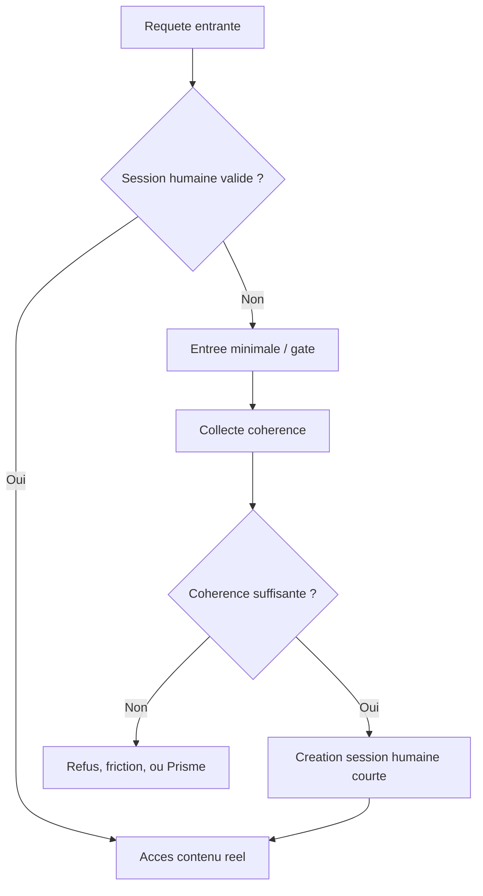

# NexAPI Antibot

## Zero Bot Mode

Ce document decrit le mode strict de NexAPI Antibot : **Zero Bot Mode**.

Dans ce mode, le site ne cherche pas a distinguer les "bons bots" des "mauvais bots".

La doctrine est simple :

> Aucun bot ne doit acceder au contenu utile, meme s'il est legitime, officiel, ou verifie.

Cela inclut :

- Googlebot ;
- Bingbot ;
- crawlers Microsoft ;
- crawlers SEO ;
- scrapers ;
- scanners automatises ;
- navigateurs automatises ;
- agents IA ;
- bots qui imitent un humain.

Le site devient donc un service **human-only**.

---

## 1. Doctrine

### 1.1 Principe central

En mode normal, NexAPI peut classer les visiteurs en plusieurs familles :

```txt
human_session
trusted_machine
unknown_machine
hostile_automation
```

En Zero Bot Mode, cette separation change :

```txt
human_session       -> acces possible
trusted_machine     -> refuse
unknown_machine     -> refuse ou Prisme
hostile_automation  -> refuse ou Prisme strict
```

La categorie `trusted_machine` n'accorde plus aucun privilege.

Un crawler officiel reste une machine. Il est donc bloque.

### 1.2 Objectif

Le but n'est pas d'ameliorer le SEO.

Le but est de proteger :

- les donnees ;
- les prix ;
- le contenu strategique ;
- les APIs ;
- les pages produit ;
- les tableaux de bord ;
- les workflows metier ;
- l'avantage concurrentiel.

### 1.3 Consequence assumee

Zero Bot Mode implique :

- pas d'indexation Google/Bing classique ;
- pas de referencement naturel complet ;
- moins d'apercus enrichis ;
- moins de visibilite organique ;
- risque que certains outils externes ne puissent pas analyser le site ;
- besoin de canaux d'acquisition alternatifs.

Ce mode est coherent pour :

- apps privees ;
- SaaS B2B ;
- dashboards ;
- extranets ;
- portails clients ;
- sites avec donnees sensibles ;
- catalogues confidentiels ;
- APIs commerciales ;
- plateformes anti-scraping.

Il est moins adapte a :

- blogs publics ;
- medias ;
- ecommerce grand public dependants du SEO ;
- documentation publique ;
- landing pages d'acquisition.

---

## 2. Regle d'Or

Le contenu utile ne doit jamais etre servi directement a une requete non validee.

Mauvais modele :

```txt
/produit/123 -> HTML complet avec toutes les donnees
```

Bon modele :

```txt
/              -> entree minimale
/gate          -> validation humaine et coherence
/app           -> contenu reel apres session validee
/api/*         -> donnees seulement si session validee
```

Le serveur ne doit pas se contenter de cacher le contenu avec JavaScript.

Le contenu sensible doit etre absent de la reponse initiale si la session n'est pas validee.

---

## 3. Configuration

### 3.1 Variables d'environnement

```txt
ANTIBOT_ZERO_BOT_MODE=true
ANTIBOT_ALLOW_SEARCH_CRAWLERS=false
ANTIBOT_ROBOTS_POLICY=disallow_all
ANTIBOT_REQUIRE_HUMAN_SESSION=true
ANTIBOT_PUBLIC_ENTRY_ONLY=true
ANTIBOT_PRISME_FOR_UNKNOWN_BOTS=true
ANTIBOT_PRISME_FOR_VERIFIED_CRAWLERS=false
```

### 3.2 Modes compatibles

| Mode | Description |
|---|---|
| `observe` | Observe les bots mais ne bloque pas encore |
| `soft_zero_bot` | Bloque les crawlers officiels et limite les inconnus |
| `zero_bot` | Aucun bot ne peut acceder au contenu utile |
| `zero_bot_strict` | Refus dur, ban temporaire, Prisme strict pour usurpation |

---

## 4. Robots et Indexation

### 4.1 robots.txt

En Zero Bot Mode :

```txt
User-agent: *
Disallow: /
```

Cela signale clairement aux crawlers respectueux qu'ils ne doivent pas explorer le site.

### 4.2 Headers

Ajouter sur les reponses publiques :

```txt
X-Robots-Tag: noindex, nofollow, noarchive, nosnippet
```

### 4.3 Meta HTML

Sur les pages HTML publiques :

```html
<meta name="robots" content="noindex,nofollow,noarchive,nosnippet">
```

### 4.4 Important

`robots.txt` et `noindex` ne bloquent pas les bots hostiles.

Ils servent seulement a :

- signaler la politique du site ;
- eviter l'indexation par les bots respectueux ;
- reduire les conflits avec les crawlers legitimes.

Le vrai blocage doit etre applique cote serveur.

---

## 5. Traitement des Crawlers Officiels

### 5.1 Verification

Le systeme peut quand meme verifier Googlebot, Bingbot, ou Microsoft crawler.

Mais cette verification ne sert plus a autoriser.

Elle sert a classifier proprement.

```js
if (isVerifiedGooglebot(req)) {
  req.botClass = "verified_search_crawler";
}

if (isVerifiedBingbot(req)) {
  req.botClass = "verified_search_crawler";
}
```

### 5.2 Decision

En Zero Bot Mode :

```js
if (req.botClass === "verified_search_crawler") {
  return "deny_crawler";
}
```

### 5.3 Reponse recommandee

Utiliser une reponse sobre :

```txt
403 Access restricted
```

ou :

```txt
401 Human session required
```

Ne pas renvoyer :

- faux contenu ;
- faux prix ;
- redirection vers Google ;
- message technique ;
- details de detection ;
- page agressive.

---

## 6. Traitement des Faux Crawlers

### 6.1 Definition

Un faux crawler est une session qui pretend etre Googlebot, Bingbot, Microsoft, ou un autre bot legitime, mais dont l'origine n'est pas verifiee.

Exemples :

```txt
User-Agent: Googlebot
Reverse DNS non valide
IP hors source officielle
Volume eleve
Appels API directs
```

### 6.2 Classification

```js
if (claimsTrustedCrawler(req) && !isVerifiedCrawler(req)) {
  req.botClass = "crawler_spoof_suspect";
}
```

### 6.3 Decision

Les faux crawlers sont plus suspects que les crawlers inconnus.

Actions possibles :

- `deny_soft`
- `temporary_ban`
- `prisme_degraded`
- `prisme_decoy` sur endpoints non contractuels

Regle :

> Usurper Google ou Microsoft est une contradiction forte.

---

## 7. Gate Humain

### 7.1 Objectif

Le gate humain est l'entree vers le contenu reel.

Il ne doit pas ressembler a un captcha classique.

Il doit verifier :

- presence d'une session ;
- coherence du navigateur ;
- capacite de rendu ;
- perception minimale ;
- temporalite plausible ;
- intention de navigation ;
- absence d'automatisation evidente.

### 7.2 Flux



### 7.3 Page d'entree minimale

La page d'entree peut contenir :

- structure HTML minimale ;
- aucun contenu sensible ;
- aucun prix complet ;
- aucun endpoint critique expose ;
- script de validation ;
- message neutre de chargement si necessaire.

Elle ne doit pas contenir :

- donnees commerciales completes ;
- secrets ;
- listes exploitables ;
- gros catalogue ;
- contenu que l'on veut proteger.

---

## 8. Session Humaine Validee

### 8.1 Creation

Une session humaine validee est creee uniquement apres coherence suffisante.

Elle doit etre :

- opaque ;
- courte ;
- liee a l'etat serveur ;
- renouvelable ;
- revocable ;
- inutile a analyser cote client.

### 8.2 Exemple

```js
{
  sessionId: "sess_public_opaque",
  humanState: "validated",
  createdAt: 1710000000000,
  expiresAt: 1710003600000,
  coherence: {
    level: "sufficient",
    contradictions: []
  },
  permissions: {
    canViewApp: true,
    canCallSensitiveApi: true
  }
}
```

### 8.3 Expiration

La session doit expirer selon :

- duree ;
- inactivite ;
- changement brutal de contexte ;
- contradictions nouvelles ;
- abus de volume ;
- action sensible.

---

## 9. Protection des APIs

### 9.1 Regle

Aucune API utile ne doit repondre sans session humaine validee.

```js
if (!req.visitor?.humanValidated) {
  return res.status(401).json({
    error: "human_session_required"
  });
}
```

### 9.2 APIs publiques minimales

Les seules APIs accessibles sans session validee doivent etre :

- validation gate ;
- healthcheck public minimal ;
- assets publics ;
- robots.txt ;
- page d'entree ;
- eventuel endpoint de contact non sensible.

### 9.3 APIs sensibles

Toujours proteger :

- prix ;
- stocks ;
- catalogue complet ;
- recherche ;
- exports ;
- comptes ;
- dashboard ;
- formulaires ;
- paiement ;
- fichiers ;
- endpoints admin.

---

## 10. Prisme en Zero Bot Mode

### 10.1 Principe

En Zero Bot Mode, Prisme n'est pas la voie normale.

La voie normale est :

```txt
bot detecte -> refus
```

Prisme reste utile pour :

- observer un attaquant ;
- filigraner une extraction ;
- ralentir une attaque ;
- servir des leurres controles ;
- comprendre les outils adverses.

### 10.2 Quand utiliser Prisme

Utiliser Prisme si :

- le bot n'est pas officiellement verifie ;
- il tente d'imiter un humain ;
- il attaque une API non contractuelle ;
- il explore des endpoints pieges ;
- il est utile de comprendre sa strategie.

### 10.3 Quand ne pas utiliser Prisme

Ne pas utiliser Prisme contre :

- Googlebot verifie ;
- Bingbot verifie ;
- SmartScreen ou Safe Browsing ;
- action contractuelle ;
- paiement ;
- commande ;
- facture ;
- utilisateur humain incertain.

Dans ces cas, preferer un refus sobre ou un challenge humain.

---

## 11. Comportement par Type de Visiteur

| Visiteur | Classification | Decision |
|---|---|---|
| Humain coherent | `human_session` | Acces contenu reel |
| Humain incertain | `unknown_human` | Gate, friction douce |
| Googlebot verifie | `verified_search_crawler` | Refus sobre |
| Bingbot verifie | `verified_search_crawler` | Refus sobre |
| Microsoft crawler verifie | `verified_security_crawler` | Refus sobre |
| Faux Googlebot | `crawler_spoof_suspect` | Refus, ban ou Prisme strict |
| Bot inconnu | `unknown_machine` | Refus ou gate impossible |
| Bot humain-like | `hostile_automation` | Refus, Prisme, ban temporaire |

---

## 12. Detection des Bots Human-Like

### 12.1 Principe

Un bot human-like peut imiter :

- mouvements de souris ;
- delais ;
- scroll ;
- navigateur reel ;
- IP residentielle ;
- comportement aleatoire.

Mais il doit rester coherent dans le temps.

Le systeme cherche donc les contradictions :

- action avant perception ;
- API avant contexte ;
- rythme trop optimise ;
- parcours sans hesitation logique ;
- extraction repetee ;
- sequence identique entre sessions ;
- changement d'IP avec meme structure comportementale ;
- rendu et actions incompatibles ;
- DOM lu mais rendu ignore.

### 12.2 Preuves de perception

Le gate doit verifier que l'action vient de ce qui est vu, pas seulement de ce qui est lu dans le DOM.

Exemples :

- cible visible avant action ;
- delai plausible apres apparition ;
- zone cliquee compatible avec le rendu ;
- ordre d'action compatible avec la presentation visuelle ;
- absence de clic sur honeypot invisible ;
- reaction correcte aux micro-variations de layout.

### 12.3 Important

Ces preuves doivent rester accessibles.

Elles ne doivent pas bloquer :

- clavier ;
- lecteur d'ecran ;
- mobile ;
- zoom ;
- reduction de mouvement ;
- utilisateur lent ;
- utilisateur rapide mais coherent.

---

## 13. Reponses Serveur

### 13.1 Crawlers officiels

```txt
HTTP 403
Access restricted
```

Headers :

```txt
X-Robots-Tag: noindex, nofollow, noarchive, nosnippet
Cache-Control: no-store
```

### 13.2 Session sans validation

```txt
HTTP 401
human_session_required
```

### 13.3 Faux crawler ou bot hostile

Options :

```txt
HTTP 403
HTTP 429
temporary ban
Prisme strict sur endpoint leurre
```

### 13.4 Ne jamais reveler

Ne jamais dire :

- "Googlebot non verifie" ;
- "webdriver detecte" ;
- "WebGL suspect" ;
- "comportement bot" ;
- "Prisme active" ;
- "score insuffisant".

Message recommande :

```txt
Access restricted
```

---

## 14. Rollout

### Phase 1 - Observation

Objectif :

- identifier crawlers officiels ;
- identifier faux crawlers ;
- mesurer impact potentiel SEO ;
- analyser appels API directs ;
- verifier faux positifs.

Action :

- ne pas bloquer ;
- journaliser ;
- simuler les decisions.

### Phase 2 - Noindex

Objectif :

- signaler la doctrine human-only.

Action :

- `robots.txt` disallow all ;
- headers `X-Robots-Tag` ;
- meta noindex.

### Phase 3 - Blocage crawlers officiels

Objectif :

- refuser les bots legitimes verifies.

Action :

- verifier crawler ;
- repondre 403 sobre.

### Phase 4 - Gate obligatoire

Objectif :

- proteger le contenu utile.

Action :

- contenu reel derriere session humaine validee ;
- APIs sensibles fermees sans session.

### Phase 5 - Strict

Objectif :

- traiter les bots human-like et usurpateurs.

Action :

- contradictions ;
- Prisme strict ;
- bans temporaires ;
- rate limits.

---

## 15. Tests Obligatoires

### 15.1 Tests crawlers officiels

- Googlebot verifie recoit 403.
- Bingbot verifie recoit 403.
- Microsoft crawler verifie recoit 403.
- Aucun contenu utile n'est renvoye.

### 15.2 Tests faux crawlers

- User-Agent Googlebot non verifie est classe suspect.
- User-Agent Bingbot non verifie est classe suspect.
- Faux crawler avec volume recoit rate limit ou ban.

### 15.3 Tests humains

- humain desktop accede apres gate.
- humain mobile accede apres gate.
- navigation clavier fonctionne.
- lecteur d'ecran ne reste pas bloque.
- utilisateur lent fonctionne.
- utilisateur rapide mais coherent fonctionne.

### 15.4 Tests APIs

- API sensible sans session recoit 401.
- API sensible avec session humaine recoit reponse normale.
- API sensible avec session expiree recoit 401.
- API sensible avec contradiction forte recoit challenge ou refus.

---

## 16. Checklist

- [ ] `robots.txt` bloque tous les bots.
- [ ] Headers `X-Robots-Tag` ajoutes.
- [ ] Meta `robots` ajoutee.
- [ ] Verification Googlebot/Bingbot implementee pour classification.
- [ ] Crawlers officiels refuses.
- [ ] Faux crawlers classes comme suspects.
- [ ] Contenu utile absent des pages non validees.
- [ ] APIs sensibles exigent session humaine.
- [ ] Session humaine opaque et courte.
- [ ] Gate compatible accessibilite.
- [ ] Prisme strict limite aux bots non officiels ou endpoints leurres.
- [ ] Aucun faux prix contractuel.
- [ ] Logs et metriques actives.
- [ ] Rollout commence en observation.

---

## 17. Resume Executif

Zero Bot Mode transforme NexAPI en systeme human-only.

Il ne cherche pas a autoriser Googlebot, Bingbot ou Microsoft sous pretexte qu'ils sont legitimes.

Il applique une doctrine claire :

> Le contenu utile appartient aux humains valides, pas aux machines.

Les bots respectueux sont informes par `robots.txt` et `noindex`.

Les crawlers officiels verifies sont refuses sobrement.

Les faux crawlers et bots hostiles sont traites comme des menaces.

Les bots human-like sont combattus par coherence causale :

- perception ;
- intention ;
- timing ;
- navigation ;
- rendu ;
- APIs ;
- historique.

Le coeur du systeme est simple :

> Pas de session humaine validee, pas de contenu utile.
