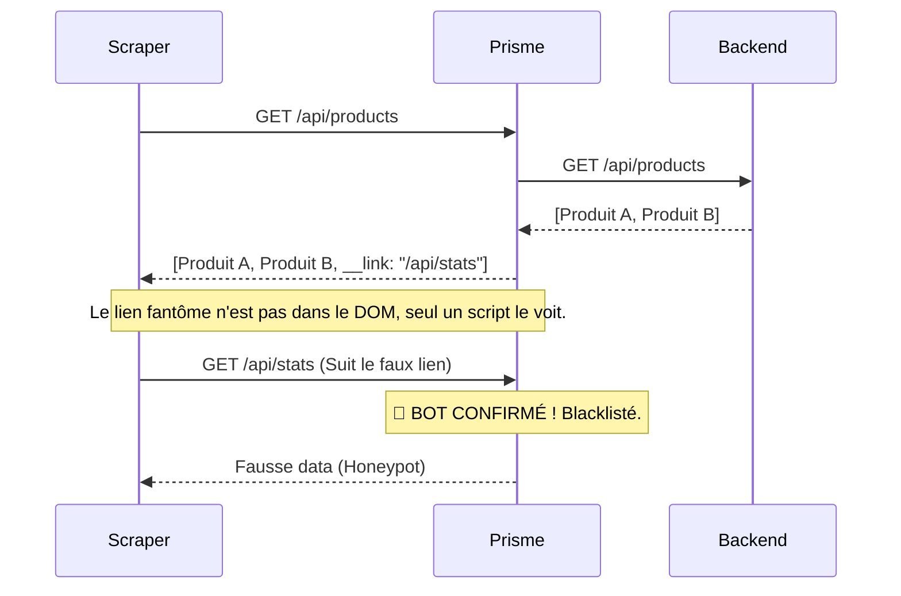

# 🌈 Prisme SDK — La Défense Anti-Scraping par l'Économie

[](https://opensource.org/licenses/MIT)
[]()
[]()

> **"Le chasseur est devenu la proie."**

Prisme n'est pas un pare-feu réseau classique. Prisme n'est pas un énième Captcha. **Prisme est une arme d'ingénierie offensive.** 
L'architecture Prisme part d'un constat simple : la détection binaire ("Est-ce un bot ou un humain ?") est devenue inefficace face aux IA et aux navigateurs *headless*. 

**La Doctrine Prisme : Ne bloquez plus aveuglément. Empoisonnez la donnée.**

Un bot *doit* scraper la couche technique (JSON, DOM). Le SDK Prisme exploite cette unique différence irréductible pour tendre des pièges structurels et ruiner économiquement l'extraction de données de l'attaquant.

---

## 📑 Table des Matières

1. [Architecture & Schémas](#-architecture--schémas)
2. [Lancer la Démo et les Tests](#-lancer-la-démo-et-les-tests)
3. [Intégration & Code](#-intégration--code)
4. [Explication des Couches (L1 à L7)](#-explication-des-couches-l1-à-l7)
5. [Le Moteur de Réfraction](#-le-moteur-de-réfraction)
6. [Dashboard d'Observabilité](#-dashboard-dobservabilité)

---

## 🏗 Architecture & Schémas

Le SDK Prisme s'appuie sur une approche multicouche ("Defense in Depth") orchestrée par un **Moteur Causal** (Prisme Core). 

### Le Flux Global (PrismeShield)

Voici comment Prisme intercepte, qualifie et punit les requêtes suspectes :

```mermaid
graph TD
    Client((Client / Scraper)) -->|Requête HTTP| L1[L1: Analyse Réseau & TLS]
    
    L1 --> Gate{A-t-il un Session Token L7 ?}
    
    Gate -->|Non (Nouveau visiteur)| Challenge[Gateway Challenge Antibot]
    Challenge -->|1. Test PoW Argon2| PoW[L3: Preuve de Travail]
    Challenge -->|2. Télémétrie Souris/Touch| Bio[L6: Biométrie & Entropie Gamma]
    
    PoW --> Orchestrator
    Bio --> Orchestrator
    
    Gate -->|Oui| Orchestrator{Orchestrateur Causal}
    
    Orchestrator -->|Humain Validé| Backend[Votre Backend / API Réelle]
    Orchestrator -->|Bot Déclaré| Block[Rejet 403 Immédiat]
    Orchestrator -->|Bot Suspect| Backend
    
    Backend -->|Renvoie JSON / HTML| Refractor[Moteur de Réfraction Prisme]
    
    Refractor -->|Si Humain| CleanJSON[JSON Intact + Watermark Invisible]
    Refractor -->|Si Bot Suspect| Poison[JSON Empoisonné + Jitter + Honeypots]
    
    CleanJSON --> Client
    Poison --> Client
```

### Le Piège du Honeypot Structurel

L'arme fatale de Prisme est le piège structurel. Le middleware injecte de faux liens dans l'API.



---

## 🎮 Lancer la Démo et les Tests

Le SDK est livré avec une application de démonstration, **NexAPI Cloud**, qui met en œuvre toutes les fonctionnalités de Prisme.

### 1. Démarrer le Serveur de Démonstration
Placez-vous à la racine du projet et lancez le serveur :
```bash
npm install
node src/server.js
```
Le serveur démarrera sur `http://localhost:3000`. Vous verrez dans la console le token Admin généré pour cette session.

### 2. Tester en tant qu'Humain
1. Ouvrez `http://localhost:3000` dans votre navigateur.
2. Vous tomberez sur la **Gateway Antibot** (un écran sombre type "Vérification de sécurité").
3. Bougez votre souris : Prisme collecte l'entropie, calcule le Proof-of-Work (votre CPU chauffe un instant) et valide votre session.
4. Vous accédez au "vrai" site de démo de NexAPI Cloud.

### 3. Tester en tant que Bot (Red Team)
Le dépôt inclut une red team structurée (Puppeteer + profils d'évasion) sous `redteam/` :
```bash
node redteam/run.js
```
**Résultat attendu :** les bots échouent au PoW ou envoient de mauvaises empreintes. Le serveur tient, les bots sont empoisonnés et leurs requêtes sont cataloguées dans les logs d'attaque.

### 4. Tester via cURL
Tentez d'accéder à l'API protégée sans session validée :
```bash
curl -v http://localhost:3000/api/prism/status
# Résultat : 401 Unauthorized {"error":"human_session_required"}
```

---

## 🛠 Intégration & Code

Prisme SDK s'adapte à votre architecture selon deux modes :

### Mode 1 : Intégration Complète (`PrismeShield`)
*Le pare-feu total. Gère le challenge utilisateur, les sessions, et les 7 couches de défense.*

```javascript
const express = require('express');
const { PrismeShield } = require('prism-sdk');

const app = express();

app.use(PrismeShield({
    adminToken: process.env.ADMIN_TOKEN, // Mot de passe du Dashboard (Généré si vide)
    challengeDifficulty: 100000,         // Difficulté Argon2 (Ajustable selon menace)
    telegramBotToken: process.env.TG_BOT_TOKEN, // Alertes des attaques graves
    telegramChatId: process.env.TG_CHAT_ID,
    zeroBotMode: true                    // Mode paranoïaque (Refuse les crawlers SEO)
}));

// Vos routes sont maintenant protégées
app.get('/api/secret', (req, res) => res.json({ secret: 42 }));
```

### Mode 2 : Moteur Core Uniquement (`prismMiddleware`)
*Si vous avez déjà Cloudflare ou un WAF maison, et que vous voulez juste "l'empoisonnement Prisme".*

```javascript
const { prismMiddleware, honeypotTrapMiddleware } = require('prism-sdk');

// Politique : Que faire de chaque champ ?
const policy = {
    price: 'actionable',     // Laisser exact (pour vos vrais clients)
    description: 'cosmetic', // Remplacer par des synonymes (pour piéger les bots)
    rank: 'aggregate'        // Bruit statistique aléatoire
};

// 1. Déclarer le piège
app.use('/__internal/v2/stats', honeypotTrapMiddleware);

// 2. Protéger votre route métier
app.use('/api/products', prismMiddleware(policy));

app.get('/api/products', (req, res) => {
    // Renvoyer les vraies données. Prisme les corrompt silencieusement pour les bots.
    res.json([{ id: 1, price: 50, description: "Super widget", rank: 10 }]);
});
```

---

## 🛡 Explication des Couches (L1 à L7)

Le "Causal Orchestrator" de Prisme ne prend jamais de décision sur un seul signal. Il construit un graphe de cohérence basé sur 7 couches :

1. **L1 (Network & TLS)** : Vérifie la cohérence des Headers HTTP et les signatures TLS (Bloque les faux User-Agents via l'ordre des headers HTTP/2).
2. **L2 (Access & Réputation)** : Whitelist ASN (ex: bloque les datacenters AWS/DigitalOcean si `zeroBotMode` est actif).
3. **L3 (Proof of Work)** : Algorithme **Argon2id**. Coûte 0.5s à un humain, mais coûte des millions de dollars en calculs CPU à un scraper distribué. Intègre un lien cryptographique liant le PoW à l'empreinte matérielle pour empêcher les fermes à clics ("PoW farm").
4. **L4 (Hardware Fingerprint)** : Vérifie la cohérence de l'écran, du GPU, du WebGL, et du Canvas.
5. **L5 (Automation & API)** : Détecte `navigator.webdriver`, les APIs CDP (Chrome DevTools Protocol) et les injections Puppeteer/Playwright.
6. **L6 (Biométrie)** : Collecte le mouvement de souris et les événements tactiles. L'Orchestrateur vérifie que la distribution des intervalles de temps respecte une vraie **loi Gamma mathématique**, impossible à simuler proprement pour un bot rudimentaire.
7. **L7 (Session & Cohérence)** : Fusionne les 6 couches précédentes en un JWT chiffré, stockant un verdict temporel (`trustScore`).

---

## 💎 Le Moteur de Réfraction & L'Univers Genèse

Au lieu de renvoyer une erreur 403, Prisme renvoie des données réfractées. C'est ce que nous appelons **L'Univers Genèse** : un univers parallèle de fausses données généré spécifiquement pour les bots.

- **Faux Visuel (Data Poisoning)** : Le bot capture l'écran ou lit le DOM, mais le prix ou les données affichées sont mathématiquement faux. Il redistribue une erreur à ses clients, perdant ainsi toute fiabilité.
- **Dégradation Temporelle (Epoch Mutation)** : L'algorithme de Réfraction (`refractor.js`) est basé sur une notion d'**Epoch** (par défaut, une rotation hebdomadaire). Une donnée aspirée ou capturée aujourd'hui sera invalidée et modifiée demain. Le scraper ne peut jamais moyenner ou stabiliser les données volées.
- **Watermarking (Traçabilité)** : Prisme modifie légèrement un texte (synonymes invisibles) en le liant au `SessionSeed` du visiteur. Si un concurrent publie votre base de données en ligne, Prisme peut vous prouver mathématiquement de quelle session exacte provient la fuite.
- **Leurre (Decoy)** : Si le bot est confondu par le Honeypot, Prisme ne répond plus la vraie donnée mais génère un JSON totalement fictif mais structurellement valide.

### Révélation Progressive (`fragmentField`)

`fragmentField` fragmente un champ numérique sur **deux canaux** : la partie entière reste dans le JSON, les centièmes partent dans une variable CSS. Un extracteur JSON naïf ne voit que l'entier (`49`), jamais la valeur exacte (`49.99`).

```javascript
const { refract, currentEpoch, fragmentField } = require('./prism-sdk');

// Après réfraction des données
const refracted = refract(rows, policy, seed, currentEpoch());

// Fragmenter le champ 'price'
const { rows: fragmented, styles: revealStyles } = fragmentField(refracted, 'price');
// fragmented[i].price    = partie entière (ex: 49)
// fragmented[i].priceVar = '--pr-price-0' (nom de la variable CSS)
// revealStyles           = ':root{--pr-price-0:99;--pr-price-1:0;}' (à injecter en <style>)

res.json({ data: fragmented, revealStyles });
```

Côté client (navigateur), injectez `revealStyles` dans un `<style>`, puis assemblez :
```javascript
// base + CSS_var/100 = valeur exacte
const cents = parseInt(getComputedStyle(document.documentElement).getPropertyValue(row.priceVar), 10) || 0;
const price = (row.price + cents / 100).toFixed(2);
```

### Watermark de Capture (`encodeWatermark` / `decodeWatermark`)

> **Ce n'est PAS un anti-screenshot.** Aucun truc client ne bloque un `page.screenshot()` en headless moderne. C'est un **traceur post-fuite** : la marque survit au pixel (screenshot, photo de l'écran) et identifie la session qui a fui.

`encodeWatermark(seed, epoch)` produit une bande visuelle déterministe (CSS) encodant l'empreinte de session, à rendre **sous** la donnée sensible, en couche séparée du filtre OCR. Le décodeur relit l'empreinte depuis une image.

```javascript
const { encodeWatermark, decodeWatermark, decodeColumns, sessionWatermarkId } = require('prism-sdk');

// ── ENCODAGE (serveur, pour les réalités dégradées uniquement) ──
const wm = encodeWatermark(seed, currentEpoch());
// wm.css        : règle CSS pour #prism-capture-wm (gradient à blocs ±luminance)
// wm.elementId  : 'prism-capture-wm'  (le client crée un <div> sibling, hors .ocr-jamming)
// wm.id         : empreinte 16 bits de la session
res.json({ data, captureWatermark: { css: wm.css, elementId: wm.elementId } });

// ── DÉCODAGE (outil forensics, depuis un screenshot) ──
// L'admin échantillonne la bande (luminance par colonne) côté navigateur, puis :
const r = decodeColumns(columns);   // rééchantillonne → décode (longueur quelconque)
// r = { valid, id, confidence, bits }
// valid:false sur bruit/recompression forte → ZÉRO fausse attribution (checksum + vote majoritaire)

// Relier l'id décodé à une session : comparer avec sessionWatermarkId(session.seed, epoch).
```

Primitives exportées : `encodeWatermark`, `decodeWatermark` (cellules alignées), `decodeColumns` (colonnes brutes, rééchantillonnées serveur), `decodeStripPixels` (image RGBA), `sessionWatermarkId`. **Limite assumée** : survit à un PNG direct + recompression légère, pas à un JPEG très agressif / fort redimensionnement.

---

## 🎛 Dashboard d'Observabilité

Prisme intègre une interface d'administration via API pour surveiller la posture de la flotte.

**Routes exposées (Nécessite le Header `x-admin-token`):**
- `GET /api/admin/stats` : Retourne la posture actuelle du bouclier (Normal, Under Attack), la difficulté dynamique du PoW, et les compteurs d'attaques.
- `GET /api/admin/visitors` : Expose l'état de l'Orchestrateur Causal pour chaque session active.
- `GET /api/admin/report` : Génère un JSON exhaustif de télémétrie pour archivage (Forensics).

---

### Résumé des Cas d'Échec des Attaquants

| Attaque | Technologie Bloquante | Résultat |
| :--- | :--- | :--- |
| **Script Simple (Python, cURL)** | Gateway + PoW (L3) + L1 | Bloqué au premier écran. Le serveur ne calcule même pas de session lourde. |
| **Puppeteer (Chrome Headless)** | Biométrie (L6) + Automation (L5) | Mouvements de souris trahis par la loi de probabilité Gamma. Session étiquetée "Suspect". |
| **Ferme à Clics / Résolution Humaine** | Cryptographic Binding (L3-L4) | Le PoW résolu par la ferme est invalidé car le hash matériel ne correspond pas au client final. |
| **Scraping Manuel Lente** | Honeypot & Watermarking | Tombe inévitablement dans un lien fantôme ou vole des données tatouées (Watermark). Poursuites légales possibles. |

---

*Prisme — Protégez votre capital donnée.*
