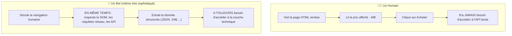
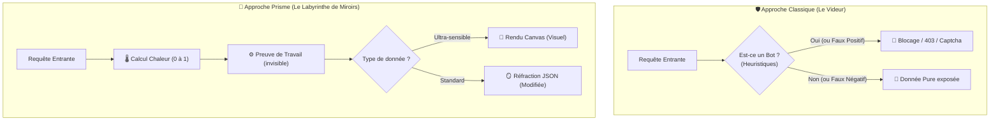
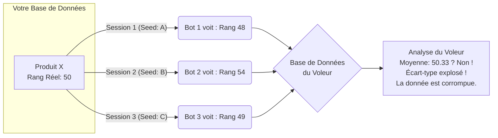

# 🌈 L'Architecture Prisme – Défense anti-scraping par l'économie

> [!TIP]
> **Règle d'or :**
> _Je ne renvoie jamais `data`. Je renvoie `refract(data, seed)`._  
> Cette discipline de codage transforme votre API en une forteresse économique, sans jamais fermer la porte à un client légitime.

---

## 0. L'Insight Fondamental : Ce que le bot ne peut PAS cacher

Avant d'aller dans le code, il faut comprendre **pourquoi** cette architecture fonctionne là où les autres échouent.

Un bot sophistiqué peut imiter presque tout :
- ✅ La vitesse de navigation humaine (délais aléatoires).
- ✅ Les mouvements de souris (courbes de Bézier).
- ✅ Le fingerprint navigateur (user-agent, plugins, résolution).

**Mais il y a une chose qu'il ne peut pas imiter : son intention.**



> [!IMPORTANT]
> **La différence irréductible :** Un humain ne regarde QUE ce qui est affiché. Un bot, même parfait, doit regarder les deux : l'affichage ET la structure sous-jacente. Il ne peut pas s'en empêcher — c'est sa raison d'être.
>
> C'est sur cette différence que repose toute l'architecture.

---

## 1. Le problème : L'impasse du blocage binaire

Les défenses classiques tentent de **bloquer les bots** en les identifiant (`if (isBot) reject()`).  
Cette approche est vouée à l'échec : elle génère des **faux positifs** (vrais clients bloqués) et des **contournements** constants.  

> [!NOTE]
> **Le problème du binaire :** "C'est un bot" / "C'est un humain" — cette décision est impossible à 100%. Un bot sophistiqué simule parfaitement un humain. Il faut changer de question.
>
> La bonne question n'est pas : **"Qui es-tu ?"**  
> La bonne question est : **"Que feras-tu de ma réponse ?"**

---

## 2. La philosophie du Prisme 🧠

Au lieu de cacher la vérité, on la **réfracte** : chaque visiteur reçoit une **version unique** des données, adaptée à sa session, mais jamais la vérité absolue sur les champs non critiques.



Cette version est :
- **Parfaitement fonctionnelle pour un humain** (prix, nom, infos vitales intactes).
- **Inutilisable en masse** pour un scraper, car les agrégations deviennent incohérentes.

---

## 3. Les briques de l'architecture

### a) Politique de champ & couche de réfraction `refract()`

Chaque champ de votre modèle reçoit une **politique** :

| Politique | Signification | Exemples |
| :--- | :--- | :--- |
| `actionable` 🛡️ | **Intouchable** | Prix, posologie, contrat |
| `cosmetic` 💄 | **Filigranable** | Synonymes, ordre, formatage |
| `aggregate` 🎲 | **Empoisonnable à l'agrégat** | Rangs, popularité |

```typescript
const PRODUCT_POLICY = {
  price:       "actionable",
  sku:         "actionable",
  description: "cosmetic",
  rank:        "aggregate",
  popularity:  "aggregate",
};
```

La fonction `refract(data, policy, seed)` applique des transformations **déterministes et inoffensives** :
- `actionable` → retourne la valeur exacte.
- `cosmetic` → `applyWatermark(value, seed)` : synonymes, permutations de listes.
- `aggregate` → `applyJitter(value, seed)` : bruit additif calibré (ex. ±2% selon le seed).

```typescript
function refract<T>(rows: T[], policy: Record<string, FieldPolicy>, seed: string): T[] {
  return rows.map(row => {
    const out: any = {};
    for (const [key, value] of Object.entries(row)) {
      if (policy[key] === "actionable") out[key] = value;
      else if (policy[key] === "cosmetic") out[key] = applyWatermark(value, seed + key);
      else if (policy[key] === "aggregate") out[key] = applyJitter(value, seed, key);
    }
    return out;
  });
}
```

### b) Chaleur continue & Preuve de Travail invisible (PoW) 🌡️

Au lieu d'un `isBot` binaire, on calcule une **chaleur** continue entre 0 et 1 à partir de signaux ambiants (JA4, proxys, fréquence, comportement). Cette chaleur **module le coût d'accès** sans jamais bloquer.

**Mécanisme :**
1. Le BFF reçoit la requête, calcule la chaleur.
2. Il répond avec un **challenge cryptographique** (preuve de travail).
3. Le client (via JS) résout le problème en arrière-plan.
4. Il renvoie la solution ; si correcte, la donnée est servie via `refract()`.

**Difficulté adaptative :**
```typescript
const difficulty = Math.floor(heat ** 3 * MAX_DIFFICULTY);
```
- **Pour un humain** (chaleur ~0.1) → problème trivial résolu en <50 ms.
- **Pour un bot intensif** (chaleur ~0.8) → calcul lourd qui explose le CPU.

### c) Rendu dynamique (Canvas/WebGL) pour les données critiques 🎨

Pour les "joyaux" (prix, catalogues ultra-sensibles), on ne renvoie **plus de HTML ni de JSON structuré**.
Le serveur envoie un script de dessin propriétaire. Le client exécute un pipeline graphique (Canvas 2D ou WebGL) qui **affiche visuellement l'information**.

Le bot reçoit un flux de pixels sans structure, l'obligeant à utiliser une reconnaissance optique (OCR) coûteuse. Des perturbations visuelles imperceptibles pour l'œil humain (bruit, distorsions, glyphes alternatifs) rendent l'OCR peu fiable.

**Exemple simplifié :**
```typescript
function generateCanvasScene(seed: string, heat: number): string {
  return `
    const canvas = document.getElementById('display');
    const ctx = canvas.getContext('2d');
    ctx.font = '16px PrismFont';
    ctx.fillStyle = '#000';
    ctx.fillText('${watermarkText("Prix : 49,99€", seed)}', x, y);
    // Ajout de leurres visuels, jitter des couleurs...
  `;
}
```

---

## 4. Flux complet d'une requête

```typescript
export async function GET(req: Request) {
  const ctx = await sessionContext(req); // seed, heat, signaux

  // 1. Vérifier la preuve de travail si nécessaire
  const powSolution = req.headers.get('X-PoW-Solution');
  if (!powSolution || !verifyPoW(powSolution, ctx)) {
    return sendPoWChallenge(ctx.heat);
  }

  // 2. Récupérer la donnée brute
  const data = await db.query(...);

  // 3. Si donnée ultra-sensible → mode rendu
  if (isHighValuePath(req)) {
    return new Response(generateCanvasScene(ctx.seed, ctx.heat), {
      headers: { 'Content-Type': 'application/javascript' }
    });
  }

  // 4. Sinon, réfraction JSON classique
  return json(refract(data, PRODUCT_POLICY, ctx.seed));
}
```

---

## 5. Le Cauchemar du Bot : Plongée dans sa réalité 😱

### Cauchemar n°1 : L'empoisonnement des données (Jitter)

Le bot veut extraire le "rang" de vos produits. Il lance 3 sessions avec des IP différentes.

*La vérité (inaccessible au bot) : Le rang réel du produit X est **50**.*



### Cauchemar n°2 : Les filigranes invisibles (Watermark)

**Votre donnée réelle :** `"Ce produit est robuste et léger."`

* **Session A du Bot :** `"Ce produit est robuste et peu lourd."`
* **Session B du Bot :** `"Ce produit est résistant et léger."`

Chaque copie volée porte un filigrane unique (une empreinte cachée). Si elle fuit, on sait exactement quel compte ou quelle session l'a volée.

### Cauchemar n°3 : La facture d'infrastructure (PoW)

Le bot veut scraper 100 000 pages rapidement. La "chaleur" monte.

*   **Page 1 à 100 :** Tout va bien.
*   **Page 101 :** Challenge `difficulty = 1000`.
*   **Page 200 :** `difficulty = 50000`. 100% CPU pendant 15 secondes par requête. Sa facture cloud explose.

---

## 6. Ce que voit chaque acteur 👀

| Acteur | Expérience | Données obtenues |
| :--- | :--- | :--- |
| 👨‍💼 **L'humain légitime** | Fluide, rapide, aucun défi visible. | Prix exacts. Descriptions cohérentes. |
| 🔍 **Le bot SEO (Google)** | Chaleur forcée à 0 (liste blanche via reverse DNS). | Contenu stable pour l'indexation. |
| 🤖 **Le bot basique** | CPU qui surchauffe silencieusement. | Données maquillées et corrompues. |
| 🦾 **Le bot sophistiqué** | Doit simuler un navigateur complet, exécuter WebGL, lancer un OCR. Coût x1000. | Données bruitées. Traçable juridiquement via Watermark. |

---

## 7. Limites honnêtes du système

> [!WARNING]
> Il faut être rigoureux sur ce que le système **ne peut pas** faire :

| Scénario | Résultat |
|---|---|
| Scraper basique | ✅ Bloqué — repart avec du bruit |
| Scraper avec validation basique | ✅ Bloqué — les données semblent cohérentes |
| Bot avec ancre de vérité partielle | ⚠️ Partiellement — détecte l'anomalie sur les champs qu'il connaît déjà |
| Bot sophistiqué avec cross-validation externe | ❌ Peut détecter le miroir en comparant avec d'autres sources |

> [!NOTE]
> **Pourquoi les deux derniers ne sont pas fatals ?**  
> Un bot "avec ancre de vérité" et un bot "avec cross-validation" **ne sont pas des humains**. Ce sont des systèmes binaires. Ils savent qu'une valeur est "fausse" uniquement si :
> - Ils ont déjà la vraie valeur (ancre) → ils exposent leur historique de vol.
> - Ils croisent avec une source externe → ils doublent leur coût d'infrastructure.
>
> Dans les deux cas, **le coût d'extraction explose**. C'est exactement l'objectif.

---

## 8. Le Problème Fondamental non résolu (et pourquoi c'est acceptable)

Distinguer avec **certitude absolue** un bot très sophistiqué d'un humain reste un problème ouvert. Personne ne l'a résolu complètement.

Mais Prisme change la question : **on n'a plus besoin de cette certitude.** Même si un bot passe, la donnée qu'il obtient est :
- Personnalisée (traçable).
- Bruitée (statistiquement inutilisable en masse).
- Obtenue à un coût croissant (non rentable à l'échelle).

Le bot peut "passer". Il ne peut pas **gagner**.

---

## 9. Plan de Mise en Œuvre Progressive 🚀

1. **Commencer par `refract()`** avec une politique de champ simple (filigrane + jitter).
2. **Ajouter la preuve de travail invisible** en middleware.
3. **Basculer les pages critiques en rendu dynamique** progressivement.

Tout se branche sur le même `seed` de session, aucune refonte du code métier n'est nécessaire une fois la couche de réfraction en place.

---

## 🎁 Exemple ultra-minimal en JavaScript (Node)

```javascript
const crypto = require('crypto');

// Fausse politique
const POLICY = {
  name: 'actionable',
  description: 'cosmetic',
  rank: 'aggregate'
};

// Synonymes pour le watermark
const SYNONYMS = {
  robust: ['robust', 'sturdy', 'resilient'],
  lightweight: ['lightweight', 'light', 'not heavy']
};

// Jitter : ajoute un nombre petit et déterministe basé sur seed + champ + valeur
function jitter(value, seed, field) {
  const hash = crypto.createHash('sha256').update(seed + field + value).digest('hex');
  const fraction = parseInt(hash.slice(0, 8), 16) / 0xffffffff;
  // petit bruit entre -2 et +2
  return Math.round(value + (fraction * 4 - 2));
}

// Watermark : remplace un mot par un synonyme déterministe
function watermark(text, seed) {
  for (const [base, synonyms] of Object.entries(SYNONYMS)) {
    if (text.includes(base)) {
      const idx = parseInt(crypto.createHash('md5').update(seed + base).digest('hex'), 16) % synonyms.length;
      text = text.replace(base, synonyms[idx]);
    }
  }
  return text;
}

function refract(rows, policy, seed) {
  return rows.map(row => {
    const out = {};
    for (const [key, val] of Object.entries(row)) {
      switch (policy[key]) {
        case 'actionable':
          out[key] = val;
          break;
        case 'cosmetic':
          out[key] = watermark(val, seed + key);
          break;
        case 'aggregate':
          out[key] = jitter(val, seed, key);
          break;
        default:
          out[key] = val;
      }
    }
    return out;
  });
}

// Exemple
const data = [
  { name: 'SuperWidget', description: 'A robust and lightweight tool', rank: 3 }
];
const seed = 'session_abc123';
console.log(refract(data, POLICY, seed));
// -> description peut être "A sturdy and lightweight tool", rank peut être 5
```

> **Important :** Tout est déterministe. Avec le même `seed`, la fonction retournera toujours la même version modifiée, garantissant la cohérence pour la session de l'utilisateur.
