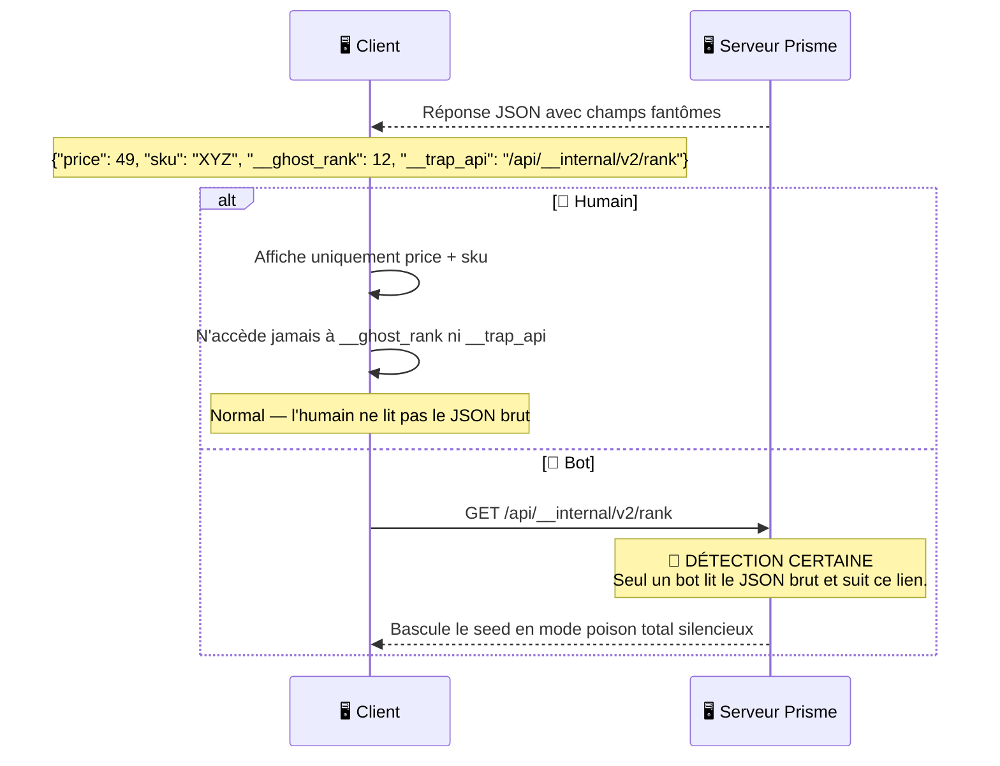
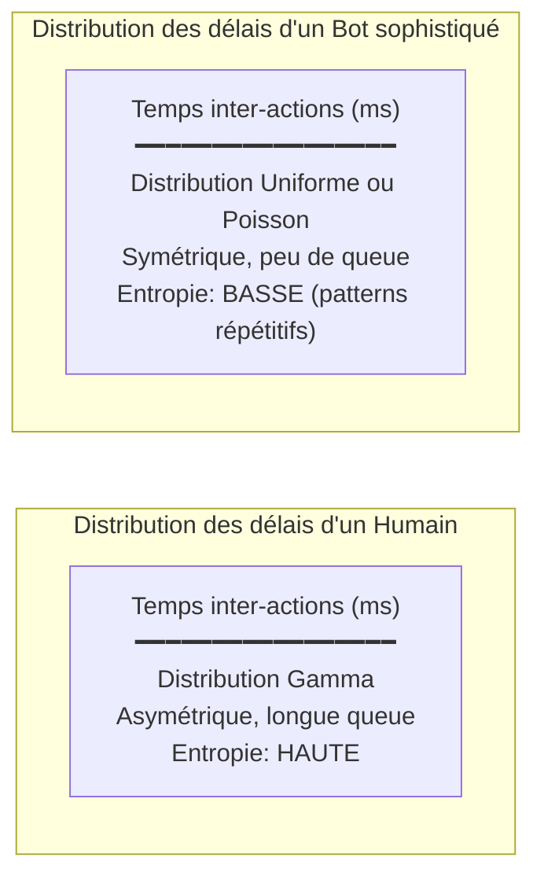
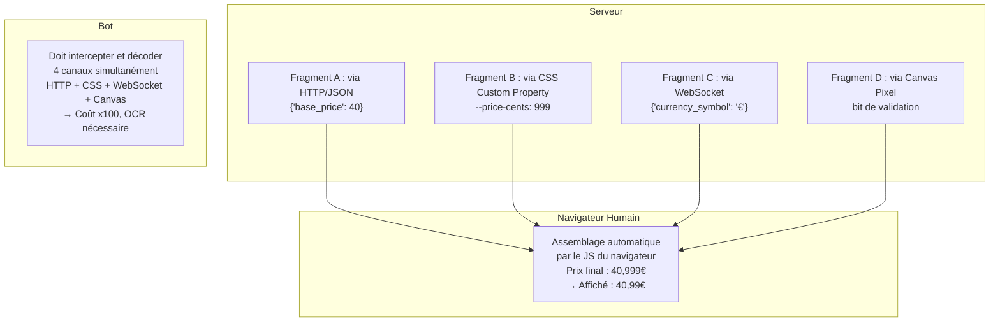

# 🚀 Prisme — Architecture Avancée : Être en Avance sur son Temps

> [!IMPORTANT]
> Ce document complète le guide Prisme de base. Il décrit trois primitives nouvelles qui exploitent **la seule différence irréductible** entre un humain et un bot.

---

## Le Point de Départ : L'Exploitation de la Nécessité Structurelle

On a établi que :
- Un humain ne lit QUE ce qui est affiché (visuellement).
- Un bot DOIT lire la couche technique (JSON, DOM brut, API, headers).

**Question :** Si le bot est obligé de lire la structure, comment l'utiliser contre lui sans jamais le bloquer ?

Réponse : On lui ment dans la structure. On lui tend des pièges dans la structure. On rend la structure impossible à lire sans être un vrai navigateur.

---

## Primitive 1 : Le Honeypot Structurel — Détection Certaine 🕳️

### Le Principe

On plante des **champs fantômes** dans la réponse JSON et des **endpoints invisibles** dans le DOM. Ces éléments :
- N'ont **jamais** de rendu visuel.
- Ne sont **jamais** accessibles à un utilisateur humain.
- Si quelqu'un les lit ou les appelle, c'est **mathématiquement** un bot.



### Ce qui est nouveau

Toutes les défenses actuelles cherchent à **déduire** si c'est un bot. Ici, on obtient une **certitude absolue** sans faux positif : un humain ne peut pas physiquement accéder à un champ JSON invisible dans l'interface.

### Exemple de code

```javascript
// Côté serveur : on injecte des pièges dans la réponse
function injectHoneypot(data, seed) {
  return {
    ...data,
    // Champ fantôme dans le JSON — jamais rendu dans l'UI
    __hpf: generateHoneypotField(seed),
    // URL fantôme jamais affichée dans le HTML
    __hpe: `/api/__hp/${seed.slice(0, 8)}`
  };
}

// Route fantôme — si elle est appelée, c'est un bot.
app.get('/api/__hp/:token', (req, res) => {
  const seed = resolveSeedFromToken(req.params.token);
  
  // On ne bloque PAS. On marque le seed comme "bot confirmé"
  // et on retourne quelque chose de plausible
  markSeedAsConfirmedBot(seed);
  
  res.json({ rank: generatePoisonedRank(seed) });
});
```

> [!TIP]
> **Zéro faux positif possible.** Un humain n'a aucune raison d'appeler `/api/__hp/...`. Ce n'est pas une heuristique — c'est une **preuve**.

---

## Primitive 2 : L'Entropie Comportementale — Mesurer l'Aléatoire Humain 🎲

### Le Principe

Un bot sophistiqué peut imiter un humain. Mais il y a une chose qu'il ne peut pas reproduire parfaitement : **la distribution statistique des actions humaines**.

Un humain se comporte selon des lois statistiques bien connues :
- **Loi de Fitts** : le temps pour cliquer sur une cible dépend de sa distance et de sa taille.
- **Temps de réaction** : suit une distribution **Gamma** (jamais parfaitement régulier, jamais parfaitement aléatoire).
- **Entropie** : les choix humains ont une entropie haute et non-uniforme.

Un bot ajoute des délais aléatoires, mais ceux-ci suivent une distribution **Uniforme ou Poisson** — pas **Gamma**. C'est mesurable.



### Ce qui est nouveau

On ne mesure pas **ce que** fait l'utilisateur (clics, scrolls). On mesure **comment** ses actions se distribuent dans le temps et l'espace. Un bot peut imiter les actions — il ne peut pas imiter l'entropie naturelle.

### Exemple de code (collecte côté client)

```javascript
// Collecte des délais inter-actions côté client, sans rien afficher
const timings = [];
let lastEvent = Date.now();

document.addEventListener('mousemove', (e) => {
  const now = Date.now();
  timings.push({
    delta: now - lastEvent,
    dx: e.movementX,
    dy: e.movementY
  });
  lastEvent = now;
  
  // Envoi silencieux tous les 20 événements
  if (timings.length >= 20) {
    const entropy = computeEntropy(timings.map(t => t.delta));
    sendSignal({ entropy, sample: timings.splice(0, 20) });
  }
});

// Mesure l'entropie de Shannon d'une distribution de délais
function computeEntropy(deltas) {
  const buckets = {};
  for (const d of deltas) {
    const bucket = Math.floor(d / 50); // buckets de 50ms
    buckets[bucket] = (buckets[bucket] || 0) + 1;
  }
  let entropy = 0;
  const n = deltas.length;
  for (const count of Object.values(buckets)) {
    const p = count / n;
    entropy -= p * Math.log2(p);
  }
  return entropy;
}
```

```typescript
// Côté serveur : utilisation de l'entropie pour calibrer la chaleur
function computeHeat(signals: SessionSignals): number {
  const { entropy, requestFrequency, ja4Fingerprint } = signals;
  
  // Entropie basse = pattern trop régulier = suspect
  const entropyScore = entropy < HUMAN_ENTROPY_THRESHOLD ? 0.8 : 0.1;
  
  // Combinaison avec les autres signaux
  return Math.min(1, (entropyScore * 0.5) + (requestFrequency * 0.3) + (ja4Score * 0.2));
}
```

---

## Primitive 3 : La Révélation Progressive — Donnée Fragmentée sur Plusieurs Canaux 🧩

### Le Principe

Au lieu de servir la donnée en un seul JSON, on la **fragmente sur plusieurs canaux** différents. Chaque fragment est inoffensif seul. La donnée complète n'existe que dans le navigateur, une fois assemblée.



### Ce qui est nouveau

Un bot peut scraper du JSON. Peut-il simultanément :
- Parser une CSS Custom Property (`--price-cents: 999`) ?
- Maintenir une connexion WebSocket ?
- Décoder un pixel dans un canvas ?
- Assembler les 4 fragments dans le bon ordre selon une clé `seed` ?

Un vrai navigateur fait tout cela naturellement. Un bot doit simuler **tout le stack navigateur** — ce qui multiplie son coût par un facteur prohibitif.

### Exemple de code

```typescript
// Serveur : fragmentation de la donnée sur plusieurs canaux
async function serveFragmented(price: number, seed: string, res: Response, ws: WebSocket) {
  
  // Fragment 1 : HTTP JSON (partie entière du prix)
  const basePart = Math.floor(price);
  
  // Fragment 2 : CSS (partie centimes, en variable CSS)
  const centsPart = Math.round((price - basePart) * 100);
  
  // Fragment 3 : WebSocket (symbole monétaire)
  ws.send(JSON.stringify({ type: 'currency', symbol: '€', seed }));
  
  // Fragment 4 : Canvas pixel (bit de validation)
  const validationPixel = generateValidationPixel(seed, price);
  
  res.json({
    data: { base_price: basePart },
    // CSS injecté dans le <style> de la page
    style: `--price-cents-${seed.slice(0, 6)}: ${centsPart};`,
    canvas: validationPixel
  });
}

// Client : assemblage des fragments
async function assemblePrice(seed: string): Promise<string> {
  // Fragment 1 : depuis le JSON
  const base = window.__prismData.base_price;
  
  // Fragment 2 : depuis les CSS custom properties
  const cents = getComputedStyle(document.documentElement)
    .getPropertyValue(`--price-cents-${seed.slice(0, 6)}`).trim();
  
  // Fragment 3 : depuis le WebSocket (déjà reçu et mis en cache)
  const symbol = window.__prismSocket.currency;
  
  return `${base}.${cents}${symbol}`; // "40.99€"
}
```

> [!NOTE]
> Un humain ne voit rien de tout cela. Son navigateur assemble silencieusement les fragments. Un bot, lui, est obligé d'émuler un navigateur complet — et même alors, il doit comprendre le protocole d'assemblage (qui dépend du `seed`).

---

## 4. Architecture d'Intégration : Comment coder ça sans devenir fou 🤯

L'ingénierie offensive est puissante, mais elle peut rapidement rendre votre propre base de code illisible. Comment intégrer la *Révélation Progressive* et le *Honeypot Structurel* dans une application React, Vue ou Angular moderne sans tout casser ?

La réponse : **Le SDK Anti-Matière (Client-side) et le Middleware Prisme (Server-side)**.

### Le Middleware Serveur (Le Distributeur)

Côté serveur (Node.js, Python, Go), votre contrôleur métier ne doit **jamais** connaître l'existence de la fragmentation. Il retourne un JSON classique. C'est un middleware de sortie qui se charge de fragmenter.

```typescript
// Le contrôleur métier reste pur
app.get('/api/products/:id', async (req, res) => {
  const product = await db.getProduct(req.params.id);
  res.json(product); // { id: 1, price: 49.99, name: "Widget" }
});

// Le Middleware Prisme (branché globalement ou par route)
app.use(prismEgressMiddleware({
  targetFields: ['price'],
  strategy: 'progressive_revelation'
}));

function prismEgressMiddleware(config) {
  return (req, res, next) => {
    const originalJson = res.json;
    res.json = function(data) {
       const heat = getHeat(req);
       const seed = getSeed(req);
       
       // Si humain sûr, on ne s'embête pas
       if (heat < 0.2) return originalJson.call(this, data);
       
       // Sinon, on fragmente et on injecte le Honeypot
       const fragmentedData = fragmentData(data, config.targetFields, seed);
       const trappedData = injectHoneypot(fragmentedData, seed);
       
       return originalJson.call(this, trappedData);
    };
    next();
  };
}
```

### Le SDK Client (L'Assembleur)

Côté client, vos composants React/Vue ne doivent pas jongler avec des variables CSS ou des WebSockets manuellement. Vous fournissez un Hook ou un Wrapper qui gère l'assemblage de manière transparente.

```tsx
// Exemple avec un Hook React
import { usePrismField } from '@mon-app/prism-sdk';

function ProductPrice({ rawData }) {
  // rawData.price est fragmenté (ex: ne contient que l'entier "49")
  // Le hook écoute le WebSocket, lit le CSS, et résout la valeur
  const { value: realPrice, isAssembling } = usePrismField(rawData.price_token, 'price');

  if (isAssembling) return <Skeleton width="50px" />;
  
  return <span className="price-tag">{realPrice}</span>;
}
```

> [!TIP]
> **Séparation des préoccupations :** Le développeur frontend utilise `<ProductPrice />` comme n'importe quel composant. Toute la complexité de l'assemblage, du décodage du pixel Canvas et de la lecture CSS est encapsulée dans le SDK.

---

## 5. La Gestion du Cycle de Vie du `Seed` (La Mémoire du Piège)

Pour que le *Honeypot Structurel* fonctionne, le serveur doit avoir une mémoire infaillible du `seed` (l'identifiant de session de l'utilisateur).

1. **Génération :** Lors de la première visite, un `seed` cryptographique est généré (ex: JWT signé) et stocké dans un cookie `HttpOnly`.
2. **Déclenchement du Piège :** Le bot lit le JSON et voit le champ `__trap_api: "/api/v2/stats/item-892"`. Il appelle cette URL.
3. **Le Jugement :** L'URL `/api/v2/stats/item-892` n'est liée à aucune fonctionnalité réelle. Le contrôleur de cette route fait une seule chose :
   ```typescript
   app.get('/api/v2/stats/:id', (req, res) => {
     const seed = req.cookies.prism_seed;
     // VERDICT SANS APPEL
     redis.set(`blacklisted_seed:${seed}`, 'true', 'EX', 86400 * 30); // Banni pour 30 jours
     
     // On ne renvoie SURTOUT PAS une 403. On donne une fausse joie.
     res.json({ views: Math.floor(Math.random() * 1000) }); 
   });
   ```
4. **L'Empoisonnement Silencieux :** Désormais, **toutes** les requêtes de ce `seed` passent en mode "Poison Total". Le middleware Prisme voit que le seed est blacklisté. Au lieu d'un simple *Jitter*, il remplace les prix par des valeurs aléatoires, les noms par des anagrammes, etc.

Le bot continue de scraper à 1000 requêtes/seconde. Il reçoit des HTTP 200. Mais **il télécharge des gigaoctets d'ordures**.

---

## Conclusion : Le Chasseur Devient la Proie

Avec ces trois primitives :
1. **Le Honeypot Structurel** force le bot à se démasquer avec 100% de certitude.
2. **L'Entropie Comportementale** détecte les scripts qui tentent d'imiter la souris humaine sans reproduire la bonne distribution statistique.
3. **La Révélation Progressive** rend le coût d'extraction d'une seule donnée (comme un prix) infiniment plus élevé pour un script Python que pour un vrai navigateur Chrome.

Le bot sophistiqué n'est plus un adversaire invisible qu'on tente de bloquer avec un mur. Il devient un visiteur qu'on invite à entrer pour mieux lui siphonner son budget cloud (Preuve de Travail) et ruiner ses bases de données (Poison Silencieux).
